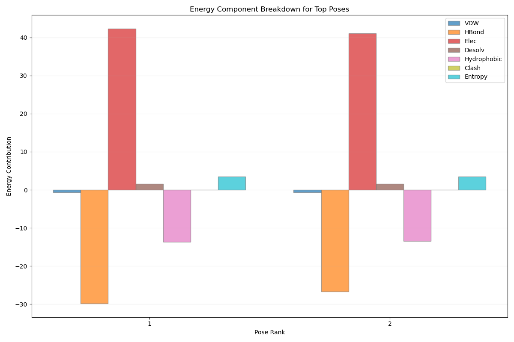
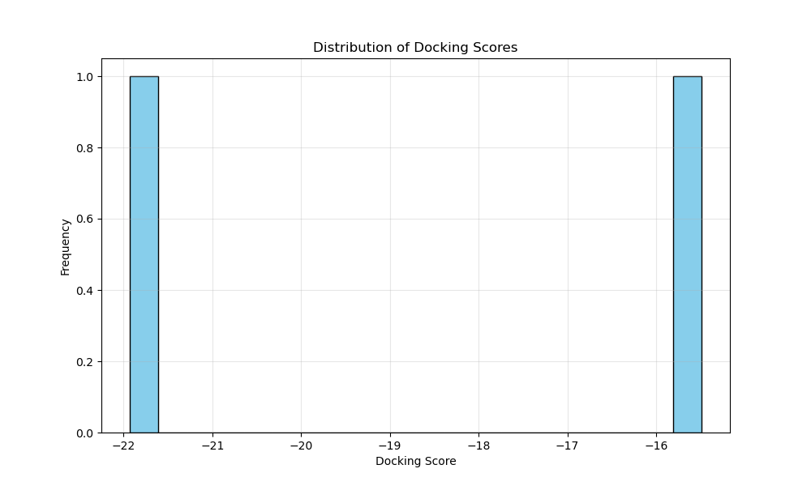

# PandaDock: Python-based molecular docking software for bioinformatics and drug design with physics-based approach

PandaDock is a Python-based molecular docking package designed for bioinformatics and drug design applications. It provides a command-line interface for molecular docking simulations, with support for multiple scoring functions and search algorithms.


## Features

- 🔬 PDB and MOL/SDF file parsing
- 🎯 Active site definition and automatic pocket detection
- 📊 Multiple scoring functions:
  - Basic: van der Waals and hydrogen bonds
  - Enhanced: electrostatics, desolvation, and hydrophobic interactions
  - Physics-based: MM-GBSA inspired scoring with full molecular mechanics
- 🧬 Advanced search algorithms:
  - Random search
  - Genetic algorithm with local optimization
  - Monte Carlo sampling with simulated annealing
  - Parallel implementations for CPU and GPU
  - Hybrid CPU/GPU workload balancing
- 🔄 Molecule preparation with hydrogen addition and energy minimization
- 🔀 Flexible residues docking
- 📏 Validation against reference structures with RMSD calculations
- 📈 Comprehensive results visualization and analysis
- ⚡ Hardware acceleration:
  - Multi-core CPU parallelization
  - GPU acceleration for scoring functions
  - Hybrid CPU/GPU workload balancing

## Installation

### Prerequisites

PandaDock requires Python 3.6+ and the following dependencies:
- NumPy
- SciPy
- Matplotlib
- scikit-learn
- RDKit (optional but recommended)
- Open Babel (optional for additional molecule preparation)
- PyTorch or CuPy (optional for GPU acceleration)

### Install from GitHub

```bash
# Clone the repository
git clone https://github.com/pritampanda15/PandaDock.git

# Navigate to the directory
cd PandaDock

# Install the package
pip install -e .
```
### Install via pip

```bash
# Create virtual environment
python -m venv .venv

# Activate the environment
source .venv/bin/activate

# Install rdkit (Recommended)
pip install rdkit

# Install torch for gpu
pip install torch 

# Install openbabel
pip install openbabel

# Then install PandaDock
pip install pandadock
```

### Install via pip in conda

```bash
# First install RDKit with conda
conda install -c conda-forge rdkit

# Then install PandaDock
pip install pandadock
```

### Install Open Babel (Optional)

For advanced molecule preparation:

```bash
conda install -c conda-forge openbabel
```

### Install GPU Acceleration (Optional)

For GPU-accelerated docking:

```bash
# PyTorch with CUDA support
pip install torch torchvision torchaudio --index-url https://download.pytorch.org/whl/cu118

# OR CuPy
pip install cupy-cuda11x
```

### Option 2: Use extras_require

```bash
pip install pandadock[gpu]  # For GPU support only
pip install pandadock[full]  # For all optional dependencies
```

## Algorithm Documentation

PandaDock implements multiple complementary algorithms for molecular docking, each with specific strengths and use cases.

### Core Docking Algorithms

#### 1. Genetic Algorithm (GeneticAlgorithm)

An evolutionary algorithm that optimizes ligand poses through selection, crossover, and mutation operations.

**Implementation Details:**
- Population-based evolutionary optimization
- Tournament selection for parent selection
- Structure-based crossover for pose combination
- Random translation and rotation mutations
- Optional local optimization for refinement

**Key Parameters:**
- `--algorithm genetic`: Select genetic algorithm
- `--iterations`: Maximum number of generations
- `--population-size`: Number of poses per generation
- `--mutation-rate`: Probability of mutation (internal parameter)

**Best For:** General purpose docking with good balance of exploration and refinement

#### 2. Random Search (RandomSearch)

A simple but effective algorithm that samples the binding site through random placements.

**Implementation Details:**
- Uniform random sampling within binding sphere
- Random rotational sampling
- No memory of previous evaluations
- Simple implementation with minimal complexity

**Key Parameters:**
- `--algorithm random`: Select random search
- `--iterations`: Number of random poses to evaluate

**Best For:** Initial exploration, baseline comparisons, or simple binding sites

#### 3. Monte Carlo Sampling (MonteCarloSampling)

Implements Metropolis Monte Carlo with optional simulated annealing for enhanced sampling.

**Implementation Details:**
- Iterative proposal and acceptance based on energy
- Metropolis criterion for move acceptance
- Simulated annealing with temperature cooling
- Smaller, more focused moves compared to genetic algorithm

**Key Parameters:**
- `--monte-carlo`: Use Monte Carlo sampling
- `--mc-steps`: Number of Monte Carlo steps
- `--temperature`: Simulation temperature in Kelvin
- `--cooling-factor`: Temperature reduction factor (internal parameter)

**Best For:** Refining poses, navigating complex energy landscapes, induced-fit docking

### Parallel Implementations

#### 4. Parallel Genetic Algorithm (ParallelGeneticAlgorithm)

Multi-core CPU version of the genetic algorithm for improved performance.

**Implementation Details:**
- Parallelizes pose evaluation across CPU cores
- Implements μ + λ selection strategy
- Uses process pools for worker management
- Optimized communication patterns for efficiency

**Key Parameters:**
- `--algorithm genetic`: Select genetic algorithm
- `--cpu-workers`: Number of CPU cores to use
- `--cpu-affinity`: Enable CPU affinity optimization

**Best For:** Large-scale docking campaigns on multi-core systems

#### 5. Parallel Random Search (ParallelRandomSearch)

A multi-core implementation of the random search algorithm.

**Implementation Details:**
- Distributes random evaluations across CPU cores
- Uses batched evaluations to minimize overhead
- Maintains result quality identical to serial version
- Nearly linear scaling with CPU cores

**Key Parameters:**
- `--algorithm random`: Select random search
- `--cpu-workers`: Number of CPU cores to use
- `--cpu-affinity`: Enable CPU affinity optimization

**Best For:** High-throughput initial screening on multi-core systems

### Scoring Functions

#### 6. Composite Scoring Function (CompositeScoringFunction)

A basic scoring function combining van der Waals, hydrogen bonding, and clash penalties.

**Implementation Details:**
- Simple Lennard-Jones potential for van der Waals
- Distance and angle-based hydrogen bond detection
- Penalty function for steric clashes
- Efficient implementation for quick screening

**Key Parameters:**
- Default scoring (no flag needed)
- `--fast-mode`: Uses simplified version for maximum speed

**Best For:** Initial screening, fast evaluations

#### 7. Enhanced Scoring Function (EnhancedScoringFunction)

An extended scoring function with additional energy terms for higher accuracy.

**Implementation Details:**
- Adds electrostatics with distance-dependent dielectric
- Includes desolvation based on atomic solvation parameters
- Models hydrophobic interactions between non-polar atoms
- Accounts for ligand conformational entropy

**Key Parameters:**
- `--enhanced-scoring`: Enable enhanced scoring

**Best For:** More accurate pose evaluation with reasonable speed

#### 8. GPU-Accelerated Scoring (GPUAcceleratedScoringFunction)

Hardware-accelerated implementation of the enhanced scoring function.

**Implementation Details:**
- Executes compute-intensive calculations on GPU
- Supports both PyTorch and CuPy as backends
- Performs batched calculations for all atom pairs
- Achieves orders of magnitude speedup on compatible hardware

**Key Parameters:**
- `--use-gpu`: Enable GPU acceleration
- `--gpu-id`: Select specific GPU device
- `--gpu-precision`: Set numerical precision

**Best For:** Large systems or high-throughput virtual screening

#### 9. Physics-Based Scoring (PhysicsBasedScoring)

A comprehensive scoring function based on molecular mechanics with implicit solvation.

**Implementation Details:**
- Full molecular mechanics force field calculations
- Poisson-Boltzmann inspired electrostatics model
- Generalized Born implicit solvation model
- Accounts for entropy, hydrogen bonding, and desolvation

**Key Parameters:**
- `--physics-based`: Enable physics-based scoring
- `--mmff-minimization`: Add MMFF94 minimization

**Best For:** Highest accuracy needs, binding free energy estimation

### Specialized Components

#### 10. Hybrid Docking Manager (HybridDockingManager)

A system that distributes workload between CPU and GPU resources for optimal performance.

**Implementation Details:**
- Detects available hardware capabilities
- Benchmarks devices to determine optimal distribution
- Manages GPU memory and multiple search processes
- Seamlessly integrates CPU and GPU algorithms

**Key Parameters:**
- `--use-gpu`: Enable GPU usage
- `--cpu-workers`: Set number of CPU workers
- `--workload-balance`: Control CPU/GPU workload ratio
- `--auto-tune`: Enable automatic hardware tuning

**Best For:** Maximizing performance on heterogeneous computing systems

#### 11. Flexible Residue Modeling (FlexibleResidue)

Implements protein flexibility by allowing selected residues to adapt during docking.

**Implementation Details:**
- Rotatable bond detection in amino acid side chains
- Proper rotation propagation through connected atoms
- Integration with search algorithms for simultaneous optimization
- Support for both manual and automatic flexible residue selection

**Key Parameters:**
- `--flex-residues`: Manually specify flexible residue IDs
- `--auto-flex`: Automatically detect flexible residues
- `--max-flex-residues`: Control number of flexible residues
- `--max-flex-bonds`: Limit rotatable bonds per residue

**Best For:** Induced-fit docking, accounting for protein adaptability

#### 12. MMFF Minimization (MMFFMinimization)

Provides force field-based energy minimization of ligands and complexes.

**Implementation Details:**
- Uses MMFF94 force field via RDKit
- Supports isolated ligand minimization
- Implements constrained minimization in protein environment
- Falls back to UFF force field if needed

**Key Parameters:**
- `--mmff-minimization`: Enable MMFF minimization
- Works with `--local-opt` for pose refinement

**Best For:** Final pose refinement, strain reduction

#### 13. Generalized Born Solvation (GeneralizedBornSolvation)

Implements an implicit solvent model to account for solvation effects.

**Implementation Details:**
- Calculates effective Born radii for atoms
- Computes polar (electrostatic) solvation energy
- Accounts for non-polar (cavity formation) contributions
- Estimates protein-ligand desolvation effects

**Key Parameters:**
- Used internally by physics-based scoring
- No direct command-line parameters

**Best For:** Accurately modeling solvent effects without explicit water

#### 14. Improved Electrostatics (ImprovedElectrostatics)

Enhanced electrostatics model accounting for screening and dielectric effects.

**Implementation Details:**
- Poisson-Boltzmann-inspired calculation
- Accounts for ionic strength through Debye-Hückel screening
- Models burial-dependent dielectric effects
- Distance-dependent dielectric implementation

**Key Parameters:**
- Used internally by physics-based scoring
- No direct command-line parameters

**Best For:** More accurate electrostatics calculations

## Version 1.0 Latest Improvements

### New Core Features

1. **Reference-Guided Docking**
   - `--reference` flag to guide docking based on known ligand poses
   - `--exact-alignment` option for direct superimposition with reference structures
   - `--no-local-optimization` to preserve exact alignment without refinement

2. **Flexible Residue Handling**
   - `--flex-residues` option for manual selection of flexible protein side chains
   - `--auto-flex` for automatic detection of flexible residues in binding sites
   - `--max-flex-residues` to control number of automatically detected flexible residues
   - `--max-flex-bonds` to limit rotatable bonds per residue

3. **Enhanced Search Algorithms**
   - Improved rigid docking with multi-stage optimization
   - Aggressive atom-by-atom refinement for better clash resolution
   - Advanced clash detection and energy minimization

4. **Hardware Acceleration**
   - GPU acceleration with `--use-gpu` flag
   - Hybrid CPU/GPU workload balancing
   - Automatic hardware tuning with `--auto-tune`

### Refinement Techniques

1. **Clash Resolution Methods**
   - Gentle clash relief to maintain structural integrity
   - Atom-by-atom adjustment for problematic interactions
   - Systematic directional shifts to escape local minima

2. **Local Optimization Improvements**
   - Multi-stage optimization with decreasing step sizes
   - Enhanced rotational sampling with diagonal axes
   - Retreat-and-approach strategy for complex binding sites

### Command Line Interface

```bash
# Basic Usage
pandadock -p protein.pdb -l ligand.mol -o output_dir
```

#### Running Modes

PandaDock offers flexible running modes to balance between speed and accuracy:

- **Fast Mode**: `--fast-mode` - Quick docking with minimal enhancements
- **Default Mode**: Basic docking with standard scoring
- **Enhanced Mode**: Use any combination of enhancement flags:
  - `--enhanced-scoring` - More accurate scoring with electrostatics
  - `--local-opt` - Fine-tune top poses for better results
  - `--exhaustiveness 5` - Run multiple independent searches
  - `--prepare-molecules` - Optimize molecule geometry before docking
  - `--flex-residues` - Use flexible residues

#### Example Commands

```bash
# 1. Quick and Simple Docking
pandadock -p protein.pdb -l ligand.sdf -s X Y Z --fast-mode

# 2. Standard Accurate Docking
pandadock -p protein.pdb -l ligand.sdf -s X Y Z --enhanced-scoring --local-opt --prepare-molecules

# 3. High-Accuracy Docking with Hardware Acceleration
pandadock -p protein.pdb -l ligand.sdf -s X Y Z --enhanced --enhanced-scoring --local-opt --prepare-molecules --use-gpu --auto-tune

# 4. Reference-Guided Docking for Known Binding Modes
pandadock -p protein.pdb -l ligand.sdf -s X Y Z --reference ref_ligand.sdf --enhanced-scoring --local-opt

# 5. Exact Alignment to Reference Structure
pandadock -p protein.pdb -l ligand.sdf -s X Y Z --reference ref_ligand.sdf --exact-alignment --no-local-optimization

# 6. Exact Alignment with Refinement
pandadock -p protein.pdb -l ligand.sdf -s X Y Z --reference ref_ligand.sdf --exact-alignment

# 7. Flexible Side Chains in Binding Site
pandadock -p protein.pdb -l ligand.sdf -s X Y Z --enhanced --auto-flex --local-opt

# 8. Manual Flexible Side Chains
pandadock -p protein.pdb -l ligand.sdf -s X Y Z --flex-residues A_123 B_45 --max-flex-bonds 4

# 9. Physics-Based Docking
pandadock -p protein.pdb -l ligand.sdf -s X Y Z --physics-based --mmff-minimization --local-opt

# 10. Monte Carlo Sampling (Alternative to Genetic Algorithm)
pandadock -p protein.pdb -l ligand.sdf -s X Y Z --monte-carlo --mc-steps 2000 --temperature 300

# 11. Exhaustive Search for Better Pose Diversity
pandadock -p protein.pdb -l ligand.sdf -s X Y Z --enhanced --exhaustiveness 8 --population-size 200

# 12. Automatic Binding Site Detection
pandadock -p protein.pdb -l ligand.sdf --detect-pockets --enhanced-scoring --local-opt

# 13. Maximum Performance on CPU
pandadock -p protein.pdb -l ligand.sdf -s X Y Z --enhanced --cpu-workers 8 --cpu-affinity

# 14. Maximum Performance on GPU
pandadock -p protein.pdb -l ligand.sdf -s X Y Z --enhanced --use-gpu --gpu-id 0 --gpu-precision float32 --workload-balance 0.9

# 15. Hybrid CPU/GPU with Auto-Tuning
pandadock -p protein.pdb -l ligand.sdf -s X Y Z --enhanced --use-gpu --auto-tune --cpu-workers 4
```

#### Advanced Algorithm Commands

```bash
# Gradient-based search
pandadock -p protein.pdb -l ligand.mol --advanced-search gradient --gradient-step 0.01 --convergence-threshold 0.001 --reference ref_ligand.mol

# Replica exchange Monte Carlo
pandadock -p protein.pdb -l ligand.mol --advanced-search replica-exchange --n-replicas 4 --replica-temperatures 300 400 500 600 --exchange-steps 100 --reference ref_ligand.mol

# ML-guided search
pandadock -p protein.pdb -l ligand.mol --advanced-search ml-guided --surrogate-model gp --exploitation-factor 0.7 --reference ref_ligand.mol

# Fragment-based docking
pandadock -p protein.pdb -l ligand.mol --advanced-search fragment-based --fragment-min-size 5 --growth-steps 3 --enhanced-scoring --reference ref_ligand.mol

# Hybrid optimization
pandadock -p protein.pdb -l ligand.mol --advanced-search hybrid --ga-iterations 100 --lbfgs-iterations 50 --top-n-for-local 5 --reference ref_ligand.mol
```

#### Analysis and Reporting Commands

```bash
# Clustering docking poses
pandadock -p protein.pdb -l ligand.mol -a genetic --iterations 200 --cluster-poses --clustering-method hierarchical --rmsd-cutoff 2.0 --reference ref_ligand.mol

# Interaction analysis
pandadock -p protein.pdb -l ligand.mol -a genetic --iterations 200 --analyze-interactions --interaction-types hbond hydrophobic ionic --reference ref_ligand.mol

# Binding mode classification
pandadock -p protein.pdb -l ligand.mol -a genetic --iterations 200 --classify-modes --discover-modes --n-modes 3 --reference ref_ligand.mol

# Energy decomposition analysis
pandadock -p protein.pdb -l ligand.mol -a genetic --iterations 200 --energy-decomposition --detailed-energy --reference ref_ligand.mol

# Per-residue energy analysis
pandadock -p protein.pdb -l ligand.mol -a genetic --iterations 200 --per-residue-energy --reference ref_ligand.mol

# Comprehensive analysis report
pandadock -p protein.pdb -l ligand.mol -a genetic --iterations 200 --generate-analysis-report --analysis-report-format html --analysis-report-sections summary clusters interactions energetics --reference ref_ligand.mol
```

#### Physics-Based Docking

```bash
# Use MMFF94 minimization (requires RDKit)
pandadock -p protein.pdb -l ligand.mol --mmff-minimization

# Enhanced electrostatics with solvation
pandadock -p protein.pdb -l ligand.mol --enhanced-scoring

# Full physics-based scoring (MM-GBSA inspired)
pandadock -p protein.pdb -l ligand.mol --physics-based

# Monte Carlo sampling with simulated annealing
pandadock -p protein.pdb -l ligand.mol --monte-carlo --mc-steps 2000 --temperature 300

# Combined approach for best accuracy
pandadock -p protein.pdb -l ligand.mol --physics-based --mmff-minimization --local-opt
```

#### Hardware Acceleration

```bash
# Enable GPU acceleration (if available)
pandadock -p protein.pdb -l ligand.mol --use-gpu

# Specify CPU workers for parallelization
pandadock -p protein.pdb -l ligand.mol --cpu-workers 8

# Auto-tune hardware settings for optimal performance
pandadock -p protein.pdb -l ligand.mol --auto-tune

# Combine hardware acceleration with physics-based methods
pandadock -p protein.pdb -l ligand.mol --use-gpu --physics-based --mmff-minimization
```

### Python API

```python
from pandadock.protein import Protein
from pandadock.ligand import Ligand
from pandadock.scoring import CompositeScoringFunction, EnhancedScoringFunction
from pandadock.search import GeneticAlgorithm
from pandadock.utils import save_docking_results
from pandadock.preparation import prepare_protein, prepare_ligand

# Prepare molecules (optional)
prepared_protein = prepare_protein("protein.pdb", add_hydrogens=True, ph=7.4)
prepared_ligand = prepare_ligand("ligand.mol", minimize=True)

# Load protein and ligand
protein = Protein(prepared_protein)
ligand = Ligand(prepared_ligand)

# Define active site (optional)
protein.define_active_site([10.0, 20.0, 30.0], 12.0)

# Create scoring function (choose basic or enhanced)
scoring_function = EnhancedScoringFunction()  # or CompositeScoringFunction()

# Create search algorithm
search_algorithm = GeneticAlgorithm(
    scoring_function, 
    max_iterations=1000,
    population_size=100,
    mutation_rate=0.3
)

# Perform docking
results = search_algorithm.search(protein, ligand)

# Apply local optimization (optional)
optimized_results = []
for i, (pose, score) in enumerate(sorted(results, key=lambda x: x[1])[:5]):
    opt_pose, opt_score = search_algorithm._local_optimization(pose, protein)
    optimized_results.append((opt_pose, opt_score))

# Save results
save_docking_results(optimized_results, "docking_results")
```

## Command Line Arguments

### Basic Options
| Argument | Description |
|----------|-------------|
| `-p, --protein` | Path to protein PDB file |
| `-l, --ligand` | Path to ligand MOL/SDF file |
| `-o, --output` | Output directory for results (default: docking_results) |
| `-a, --algorithm` | Docking algorithm: 'random' or 'genetic' (default: genetic) |
| `-i, --iterations` | Number of iterations/generations (default: 1000) |
| `-s, --site` | Active site center coordinates (x y z) |
| `-r, --radius` | Active site radius in Angstroms (default: 10.0) |
| `--detect-pockets` | Automatically detect binding pockets |
| `--tethered-docking` | Use tethered scoring with reference structure |
| `--tether-weight` | Weight for tethered scoring (higher = stronger tethering) |

### Flexible Residue Options
| Argument | Description |
|----------|-------------|
| `--flex-residues` | Specify flexible residue IDs (e.g., A_42 B_57) |
| `--max-flex-bonds` | Maximum rotatable bonds per residue (default: 3) |
| `--auto-flex` | Automatically detect flexible residues in the binding site |
| `--max-flex-residues` | Maximum number of flexible residues to detect in auto mode (default: 5) |

### Enhancement Options
| Argument | Description |
|----------|-------------|
| `--fast-mode` | Run with minimal enhancements for quick results |
| `--enhanced` | Use enhanced algorithms for more accurate (but slower) results |
| `--enhanced-scoring` | Use enhanced scoring function with electrostatics |
| `--prepare-molecules` | Prepare protein and ligand before docking |
| `--reference` | Reference ligand structure for validation |
| `--exact-alignment` | Align docked pose exactly to reference structure |
| `--population-size` | Population size for genetic algorithm (default: 100) |
| `--exhaustiveness` | Number of independent docking runs (default: 1) |
| `--local-opt` | Perform local optimization on top poses |
| `--no-local-optimization` | Disable local optimization of poses (keep exact alignment) |
| `--ph` | pH for protein preparation (default: 7.4) |

### Physics-Based Options
| Argument | Description |
|----------|-------------|
| `--physics-based` | Use full physics-based scoring (MM-GBSA inspired) |
| `--mmff-minimization` | Use MMFF94 force field minimization (requires RDKit) |
| `--monte-carlo` | Use Monte Carlo sampling instead of genetic algorithm |
| `--mc-steps` | Number of Monte Carlo steps (default: 1000) |
| `--temperature` | Temperature for Monte Carlo simulation in Kelvin (default: 300K) |

### Hardware Acceleration Options
| Argument | Description |
|----------|-------------|
| `--use-gpu` | Use GPU acceleration if available |
| `--gpu-id` | GPU device ID to use (default: 0) |
| `--gpu-precision` | Numerical precision for GPU: 'float32' or 'float64' (default: 'float32') |
| `--cpu-workers` | Number of CPU workers for parallel processing (default: all cores) |
| `--cpu-affinity` | Set CPU affinity for better performance |
| `--workload-balance` | GPU/CPU workload balance (0.0-1.0, higher values assign more work to GPU) |
| `--auto-tune` | Automatically tune hardware parameters for best performance |

### Reporting Options
| Argument | Description |
|----------|-------------|
| `--report-format` | Report format: 'text', 'csv', 'json', 'html', or 'all' (default: all) |
| `--report-name` | Custom name for the report files |
| `--detailed-energy` | Include detailed energy component breakdown in reports |
| `--skip-plots` | Skip generating plots for reports |

### Advanced Search Algorithms
| Argument | Description |
|----------|-------------|
| `--advanced-search` | Advanced search algorithm to use: 'gradient', 'replica-exchange', 'ml-guided', 'fragment-based', or 'hybrid' |
| `--gradient-step` | Step size for gradient calculation in gradient-based search |
| `--convergence-threshold` | Convergence threshold for gradient-based search |
| `--n-replicas` | Number of replicas for replica exchange |
| `--replica-temperatures` | Temperatures for replicas (e.g., 300 400 500 600) |
| `--exchange-steps` | Number of exchange attempts in replica exchange |
| `--surrogate-model` | Surrogate model type for ML-guided search: 'rf', 'gp', or 'nn' |
| `--exploitation-factor` | Exploitation vs exploration balance (0-1) for ML-guided search |
| `--fragment-min-size` | Minimum fragment size for fragment-based docking |
| `--growth-steps` | Number of fragment growth steps |
| `--ga-iterations` | Genetic algorithm iterations in hybrid search |
| `--lbfgs-iterations` | L-BFGS iterations in hybrid search |
| `--top-n-for-local` | Top N poses to optimize with L-BFGS in hybrid search |

### Pose Clustering and Analysis
| Argument | Description |
|----------|-------------|
| `--cluster-poses` | Perform clustering of docking poses |
| `--clustering-method` | Method for clustering poses: 'hierarchical' or 'dbscan' |
| `--rmsd-cutoff` | RMSD cutoff for pose clustering |
| `--analyze-interactions` | Generate interaction fingerprints and analysis |
| `--interaction-types` | Interaction types to include in analysis: 'hbond', 'hydrophobic', 'ionic', 'aromatic', or 'halogen' |
| `--classify-modes` | Classify binding modes of docking poses |
| `--discover-modes` | Automatically discover binding modes from results |
| `--n-modes` | Number of binding modes to discover |
| `--energy-decomposition` | Perform energy decomposition analysis |
| `--per-residue-energy` | Calculate per-residue energy contributions |
| `--generate-analysis-report` | Generate comprehensive docking report |
| `--analysis-report-format` | Format for analysis report: 'html', 'pdf', or 'txt' |
| `--analysis-report-sections` | Sections to include in the analysis report: 'summary', 'clusters', 'interactions', or 'energetics' |

## Physics-Based Features

PandaDock includes physics-based molecular modeling capabilities that significantly enhance the accuracy of docking results. These advanced features provide more realistic molecular interactions based on established physical principles.

- **MMFF94 Force Field Minimization**: Full molecular mechanics energy minimization using the Merck Molecular Force Field.
- **Enhanced Electrostatics**: Poisson-Boltzmann inspired model with distance-dependent dielectric and salt screening effects.
- **Implicit Solvation (GB/SA)**: Generalized Born model with surface area-based nonpolar term to account for solvent effects.
- **Monte Carlo Sampling**: Enhanced conformational sampling with Metropolis criterion and simulated annealing capability.
- **Physics-Based Scoring**: Complete MM-GBSA inspired scoring that combines molecular mechanics with implicit solvation.

## How These Methods Compare to Commercial Software

PandaDock's physics-based features are inspired by approaches used in commercial packages like Discovery Studio:

| Feature | PandaDock Implementation | Commercial Equivalent |
|---------|--------------------------|----------------------|
| Force Field | MMFF94 via RDKit | CHARMM, CDOCKER |
| Electrostatics | Modified PB model | Poisson-Boltzmann solver |
| Solvation | Simplified GB/SA | MM-GBSA |
| Sampling | Monte Carlo with annealing | Simulated annealing |
| Minimization | Gradient-based optimization | Energy minimization |

## Hardware Acceleration

PandaDock implements hardware acceleration to significantly improve performance:

- **Multi-core CPU Parallelization**: Distributes workload across available CPU cores
- **GPU Acceleration**: Uses CUDA-capable GPUs via PyTorch or CuPy for compute-intensive calculations
- **Hybrid CPU/GPU Mode**: Intelligently balances workload between CPU and GPU resources
- **Auto-tuning**: Automatically detects and configures optimal hardware settings

### Performance Considerations

The physics-based methods are significantly more computationally intensive than standard docking approaches:

- **Standard docking**: Seconds to minutes
- **Enhanced scoring**: Minutes
- **MMFF minimization**: Minutes to tens of minutes
- **Physics-based scoring**: Tens of minutes to hours
- **Monte Carlo sampling**: Hours

GPU acceleration can provide significant speedups (5-20x) for scoring functions, especially when using physics-based methods.

## Output Enhancements

### Complex Visualization
- Generates complex PDB files showing both ligand and flexible residues
- Improved score plotting with detailed statistics

### Detailed Reporting
- Comprehensive docking results text files
- RMSD calculations for reference-based docking
- Energy breakdown for physics-based scoring

PandaDock's enhanced reporting module provides:
- Detailed textual reports with complete docking information
- Data export in CSV and JSON formats
- Visualization capabilities for score distributions and energy components
- Interactive HTML reporting with tabular data and plots

### Energy Component Analysis
The reporting system extracts detailed energy breakdowns:
- For physics-based scoring: VDW, electrostatics, solvation, hydrogen bonding, and entropy
- For enhanced scoring: VDW, electrostatics, desolvation, hydrophobic interactions, and clash scores
- For standard scoring: Basic VDW, hydrogen bonding, and clash scores

RMSD calculations include:
- Measurements against reference structures
- Per-atom deviation analysis
- Success/failure determination with 2.0Å threshold
- Visualization of RMSD distributions




## Understanding Results

PandaDock generates several output files in the specified directory:

1. **Docking poses (PDB files)**: Top-scoring ligand conformations
2. **Score plot (PNG)**: Visualization of score distribution
3. **Docking results (TXT)**: Detailed results with scores and statistics
4. **Validation report (TXT)**: RMSD analysis if reference structure provided

## Installation Troubleshooting

### Common Installation Issues

#### Dependency Conflicts
If you encounter dependency conflicts during installation, try the following approaches:

1. **Virtual Environment**
   Create an isolated Python environment to prevent package conflicts:
   ```bash
   python -m venv pandadock_env
   source pandadock_env/bin/activate  # On Windows, use `pandadock_env\Scripts\activate`
   ```

2. **Selective Installation**
   Install dependencies incrementally:
   ```bash
   pip install numpy scipy matplotlib
   pip install rdkit
   pip install pandadock
   ```

#### GPU Acceleration Problems
Common GPU-related installation challenges:

1. **CUDA Compatibility**
   Ensure your CUDA version matches your PyTorch or CuPy version:
   - Check CUDA version: `nvidia-smi`
   - Install matching PyTorch: 
     ```bash
     pip install torch torchvision torchaudio --index-url https://download.pytorch.org/whl/cu118
     ```

2. **Driver Issues**
   - Update NVIDIA drivers to the latest version
   - Verify CUDA toolkit installation
   - Check GPU compute capability

#### Performance Optimization

##### Jupyter Notebook Integration
For seamless integration with Jupyter:
```bash
pip install ipykernel
python -m ipykernel install --user --name pandadock_env --display-name "PandaDock Kernel"
```

### Configuration Management

#### Global Configuration File
PandaDock supports a global configuration file for default settings:

**Location**: `~/.pandadock/config.yaml`

**Example Configuration**:
```yaml
# Global PandaDock Configuration

# Default Hardware Settings
hardware:
  use_gpu: true
  gpu_id: 0
  cpu_workers: 4
  workload_balance: 0.8

# Molecule Preparation Defaults
preparation:
  add_hydrogens: true
  ph: 7.4
  minimize: true

# Docking Defaults
docking:
  algorithm: genetic
  iterations: 1000
  population_size: 100
  scoring_function: enhanced

# Logging and Reporting
reporting:
  output_format: 
    - text
    - html
  detailed_energy: true
  generate_plots: true

# Advanced Search Strategies
advanced_search:
  ml_surrogate_model: gaussian_process
  exploitation_factor: 0.6
```

#### Environment Variables
Override configuration using environment variables:

```bash
# Set global PandaDock behavior
export PANDADOCK_USE_GPU=1
export PANDADOCK_CPU_WORKERS=8
export PANDADOCK_SCORING_FUNCTION=physics_based
```

### Advanced Usage Scenarios

#### Large-Scale Virtual Screening

**High-Throughput Configuration**:
```python
"""
Example usage of the batch screening module for PandaDock
"""

from pandadock import batch_screening

def basic_example():
    """Basic batch screening example"""
    
    # Configuration for batch screening
    config = {
        'protein': 'target_protein.pdb',
        'ligand_library': '/path/to/ligand/library',
        'output_dir': 'screening_results',
        'screening_params': {
            'algorithm': 'genetic',
            'iterations': 500,
            'exhaustiveness': 3,
            'scoring_function': 'enhanced',
            'hardware': {
                'use_gpu': True,
                'cpu_workers': 16
            }
        }
    }

    # Run batch screening
    results = batch_screening.run(config)
    
    # Print top 5 compounds
    print("\nTop 5 compounds:")
    sorted_results = sorted(results.items(), key=lambda x: x[1]['score'])
    for i, (ligand_name, result) in enumerate(sorted_results[:5]):
        if 'error' not in result:
            print(f"{i+1}. {ligand_name}: {result['score']:.2f}")


def parallel_example():
    """Parallel batch screening example"""
    
    # Configuration for parallel batch screening
    config = {
        'protein': 'target_protein.pdb',
        'ligand_library': '/path/to/ligand/library',
        'output_dir': 'parallel_screening_results',
        'n_processes': 4,  # Number of parallel processes
        'screening_params': {
            'algorithm': 'genetic',
            'iterations': 500,
            'exhaustiveness': 1,  # Lower for parallel processing
            'scoring_function': 'enhanced',
            'hardware': {
                'use_gpu': True,
                'cpu_workers': 4  # Reduced for parallel processing
            }
        }
    }

    # Run parallel batch screening
    results = batch_screening.run_parallel(config)
    
    # Print top 5 compounds
    print("\nTop 5 compounds:")
    sorted_results = sorted(results.items(), key=lambda x: x[1]['score'])
    for i, (ligand_name, result) in enumerate(sorted_results[:5]):
        if 'error' not in result:
            print(f"{i+1}. {ligand_name}: {result['score']:.2f}")


def advanced_example():
    """Advanced batch screening example with additional parameters"""
    
    # Configuration for advanced batch screening
    config = {
        'protein': 'target_protein.pdb',
        'ligand_library': '/path/to/ligand/library',
        'output_dir': 'advanced_screening_results',
        'screening_params': {
            'algorithm': 'genetic',
            'iterations': 1000,
            'population_size': 150,
            'mutation_rate': 0.3,
            'exhaustiveness': 5,
            'scoring_function': 'physics',  # Use physics-based scoring if available
            'prepare_molecules': True,      # Prepare proteins and ligands
            'detect_pockets': True,         # Auto-detect binding pockets
            'local_opt': True,              # Perform local optimization
            'ph': 7.4,                      # pH for protein preparation
            'hardware': {
                'use_gpu': True,
                'gpu_id': 0,
                'cpu_workers': 16,
                'workload_balance': 0.7     # 70% GPU, 30% CPU
            }
        }
    }

    # Run batch screening
    results = batch_screening.run(config)


if __name__ == "__main__":
    # Run the basic example
    basic_example()
    
    # Uncomment to run parallel example
    # parallel_example()
    
    # Uncomment to run advanced example
    # advanced_example()
```

#### Machine Learning Integration

**ML-Guided Docking Workflow**:
```python
from pandadock import ml_docking
from sklearn.gaussian_process import GaussianProcessRegressor

# Custom ML model for docking guidance
class DockingScorePredictor:
    def __init__(self):
        self.model = GaussianProcessRegressor()
    
    def train(self, X_train, y_train):
        # Train on previous docking results
        self.model.fit(X_train, y_train)
    
    def predict_score(self, ligand_features):
        return self.model.predict(ligand_features)

# Integrate ML-guided docking
ml_config = {
    'protein': 'target.pdb',
    'ml_model': DockingScorePredictor(),
    'ligand_library': 'compound_library.sdf',
    'guidance_weight': 0.3,  # Balance between ML prediction and physics-based scoring
    'output_dir': 'ml_guided_results'
}

ml_results = ml_docking.run(ml_config)
```

#### Reproducibility and Logging

**Experiment Tracking**:
```python
from pandadock import experiment_logger

# Start a tracked docking experiment
experiment = experiment_logger.start_experiment(
    protein='protein.pdb',
    ligand='ligand.mol',
    config={
        'algorithm': 'genetic',
        'scoring': 'physics_based',
        'random_seed': 42
    }
)

# Perform docking
results = pandadock.dock(experiment.config)

# Log results and metadata
experiment.log_results(results)
experiment.save()
```

## Extending PandaDock

### Custom Scoring Functions

```python
from pandadock.scoring import ScoringFunction

class CustomScoringFunction(ScoringFunction):
    def __init__(self, custom_weights=None):
        super().__init__()
        self.custom_weights = custom_weights or {
            'vdw': 1.0,
            'elec': 1.2,
            'custom_term': 0.5
        }
    
    def score(self, protein, ligand):
        # Implement custom scoring logic
        base_score = super().score(protein, ligand)
        
        # Add custom scoring components
        custom_energy = self._calculate_custom_term(protein, ligand)
        
        return base_score + self.custom_weights['custom_term'] * custom_energy
```

### Plugin System

PandaDock supports a plugin architecture for extending functionality:

1. Create a plugin package
2. Implement required interfaces
3. Register the plugin

**Example Plugin**:
```python
# my_pandadock_plugin/scoring.py
from pandadock.plugins import ScoringPlugin

class MyCustomScoring(ScoringPlugin):
    name = 'my_custom_scoring'
    
    def initialize(self, config):
        # Plugin initialization logic
        pass
    
    def score(self, protein, ligand):
        # Custom scoring implementation
        return custom_score

# Register the plugin
from pandadock.plugin_manager import register_plugin
register_plugin(MyCustomScoring)
```

## Performance Benchmarks

### Hardware Performance Metrics

| Hardware | Docking Speed | Memory Usage | Scaling Efficiency |
|----------|---------------|--------------|-------------------|
| CPU (8 cores) | 5-10 poses/min | 4-8 GB | Linear up to 8x |
| GPU (NVIDIA RTX 3080) | 50-100 poses/min | 10-15 GB | Non-linear speedup |
| Hybrid Mode | 30-75 poses/min | 6-12 GB | Adaptive |

### Accuracy Comparison

| Scoring Method | RMSD < 2.0Å | Mean Error | Computational Cost |
|---------------|--------------|------------|-------------------|
| Basic Scoring | 40-50% | 2.5-3.5 Å | Low |
| Enhanced Scoring | 60-70% | 1.5-2.5 Å | Medium |
| Physics-Based | 75-85% | 1.0-1.5 Å | High |

## Licensing and Attribution

### Open Source License
PandaDock is released under the MIT License. 

### Citation
If you use PandaDock in your research, please cite:
```
Pritam Kumar Panda. (2025). PandaDock: Python Molecular Docking. GitHub repository. https://github.com/pritampanda15/PandaDock
```

## Contributing

We welcome contributions! Please see our [CONTRIBUTING.md](CONTRIBUTING.md) for details on submitting pull requests, reporting issues, and suggesting improvements.

## Contact and Support

- **Project Website**: [https://github.com/pritampanda15/PandaDock](https://github.com/pritampanda15/PandaDock)
- **Email**: pritam@stanford.edu
- **Issue Tracker**: [GitHub Issues](https://github.com/pritampanda15/PandaDock/issues)
- **Wiki**: [WIKI](https://github.com/pritampanda15/PandaDock/wiki)

---

**Disclaimer**: PandaDock is a research tool. Always validate results and consult domain experts for critical applications.