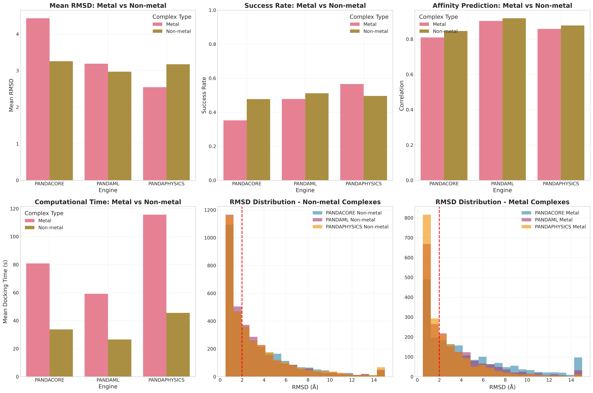
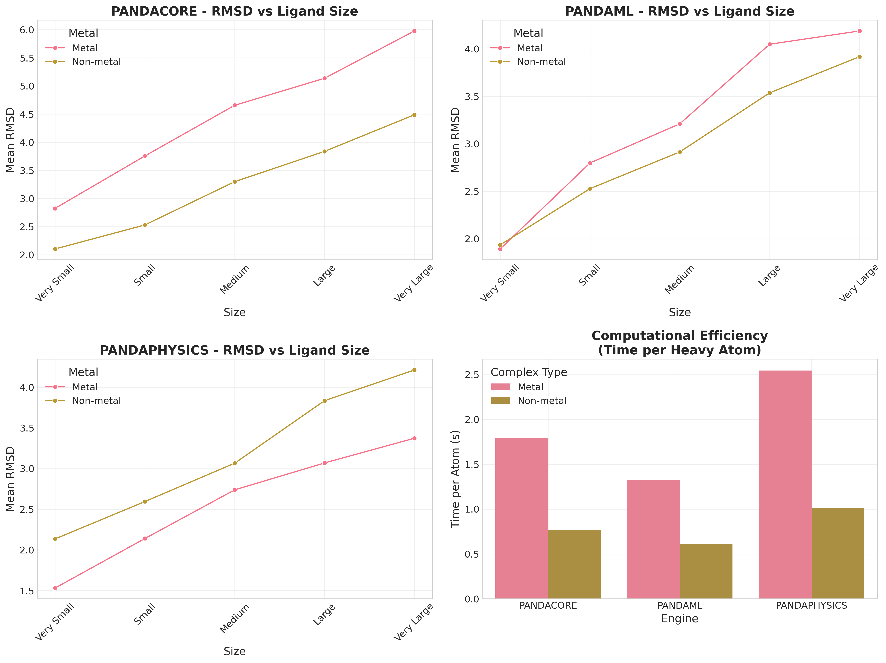

# PandaDock

**Python-based Molecular Docking Platform featuring Novel PandaDock Algorithms for Drug Discovery, Bioinformatics, and Computational Chemistry.** **A Modular, Multi-Strategy, High-Performance Molecular Docking Software**

<p align="center">
  <a href="https://github.com/pritampanda15/PandaDock">
    
  </a>
</p>

<p align="center">
  <a href="https://pypi.org/project/pandadock/">
    
  </a>
  <a href="https://github.com/pritampanda15/PandaDock/blob/main/LICENSE">
    
  </a>
  <a href="https://github.com/pritampanda15/PandaDock/stargazers">
    
  </a>
  <a href="https://github.com/pritampanda15/PandaDock/issues">
    
  </a>
  <a href="https://github.com/pritampanda15/PandaDock/network/members">
    
  </a>
  <a href="https://pepy.tech/project/pandadock">
    
  </a>
</p>

<p align="center">
  <a href="https://www.python.org/downloads/">
    
  </a>
  <a href="https://opensource.org/licenses/MIT">
    
  </a>
  <a href="https://pandadock.readthedocs.io/">
    
  </a>
</p>

---


## 🎯 Overview

PandaDock is a comprehensive molecular docking software that combines multiple docking strategies in a unified framework. It features **three novel PandaDock algorithms** - PandaCore, PandaML, and PandaPhysics - for protein-ligand docking with comprehensive analysis and reporting capabilities.

## 🏆 Comprehensive Benchmark Results

**Large-scale evaluation on 5,316 PDBbind complexes (15,948 total docking runs):**

<p align="center">
  
</p>

### Algorithm Performance Rankings:

| Algorithm | Affinity R² | Pearson R | Success Rate | Mean RMSD | Speed |
|-----------|-------------|-----------|--------------|-----------|-------|
| **PandaML** | **0.845** | **0.919** | **49.0%** | **3.11 Å** | **26.7s** |
| **PandaPhysics** | 0.769 | 0.877 | 48.3% | 3.20 Å | 45.6s |
| **PandaCore** | 0.709 | 0.842 | 47.1% | 3.31 Å | 33.7s |

*Success Rate = RMSD < 2Å. Benchmarked on 5,316 diverse protein-ligand complexes from PDBbind database.*

### Detailed Performance Analysis:

#### Correlation Analysis:
<p align="center">
  
</p>

#### RMSD Distribution Analysis:
<p align="center">
  
</p>

#### Performance vs Molecular Properties:
<p align="center">
  
</p>

#### Ligand Complexity Analysis:
<p align="center">
  
</p>

**Key Findings:**
- **PandaML** achieves superior affinity prediction with R² = 0.845 and Pearson R = 0.919
- **Consistent Performance**: All algorithms show ~47-49% success rates with robust pose prediction  
- **Computational Efficiency**: PandaML offers the best speed/accuracy trade-off at 26.7s per complex
- **Large-scale Validation**: Results confirmed across 5,316 complexes from the entire PDBbind database
- **Robust Across Complexity**: Performance maintained across diverse ligand sizes and binding affinities

### Metal vs Non-Metal Specialization:

<p align="center">
  
</p>

**Comprehensive Metal Analysis (Full PDBbind Dataset):**
- **1,982 metal complexes** (37.3%) vs **3,334 non-metal complexes** (62.7%) analyzed
- **PandaPhysics excels with metals**: 56.6% success rate vs 49.6% for non-metals
- **PandaML maintains balance**: 47.8% vs 51.2% success rates respectively
- **Metal complexity confirmed**: Higher computational demands with specialized coordination chemistry

#### Metal Distribution Analysis:
<p align="center">
  
</p>

#### Metal vs Non-Metal Performance:
<p align="center">
  
</p>

#### Metal Coordination Analysis:
<p align="center">
  
</p>

## ✨ Key Features

### 🧬 **Three Novel PandaDock Algorithms**
- **PandaCore**: Robust baseline algorithm with excellent general performance
- **PandaML**: Advanced machine learning-based algorithm with superior affinity prediction
- **PandaPhysics**: Physics-based algorithm specialized for metal coordination and complex chemistry

### 🚀 **Advanced Capabilities**
- **Flexible Docking**: Side-chain flexibility with rotamer library sampling
- **Metal Coordination**: Specialized handling of metal-containing complexes
- **Comprehensive Scoring**: Physics-based + ML rescoring with detailed energy breakdown
- **Multi-format Support**: SMILES, SDF, MOL2, PDB input formats
- **Interactive Reports**: HTML reports with pose visualization and analysis

### ⚡ **Performance Features**
- **GPU Acceleration**: CUDA support for ML models
- **Parallel Processing**: Multi-threading for optimized calculations
- **Memory Efficient**: Optimized for large-scale virtual screening
- **Extensible Architecture**: Easy to add new docking algorithms

## 🛠️ Installation

### Quick Install
```bash
# Basic installation
pip install -e .

# With machine learning support
pip install -e .[ml]

# With all features
pip install -e .[all]
```

### Requirements
- Python 3.8+
- NumPy, SciPy, scikit-learn (automatically installed)
- Optional: PyTorch (ML models), RDKit (chemistry), OpenMM (physics)

For detailed installation instructions, see [INSTALL.md](INSTALL.md).

### Install from PyPI
```bash
pip install pandadock
```

### Install from Source
```bash
git clone https://github.com/pritampanda15/pandadock.git
cd pandadock
pip install -e .[all]
```

## 🚀 Quick Start

### Basic Docking with Novel PandaDock Algorithms
```bash
# PandaML algorithm (best overall performance)
pandadock --protein receptor.pdb --ligand ligand.sdf --mode balanced --scoring pandaml

# PandaPhysics algorithm (best for metal complexes)
pandadock --protein receptor.pdb --ligand ligand.sdf --mode precise --scoring pandaphysics \
          --flexible-residues "HIS57,SER195" --out results.html

# PandaCore algorithm (reliable baseline)
pandadock --protein receptor.pdb --ligand ligand.sdf --mode fast --scoring pandacore

# Fast virtual screening with PandaML
pandadock --protein receptor.pdb --screen ligands.smi --mode fast --scoring pandaml \
          --num-poses 5 --exhaustiveness 16
```

### Python API
```python
from pandadock import PandaDockConfig, PhysicsEngine, MLEngine, GAEngine

# Configure docking with PandaML algorithm
config = PandaDockConfig()
config.docking.mode = "balanced"
config.docking.num_poses = 10
config.docking.flexible_residues = ["HIS57", "SER195"]
config.scoring.scoring_function = "pandaml"

# Initialize engine
engine = MLEngine(config)

# Run docking
results = engine.dock("receptor.pdb", "ligand.sdf")

# Analyze results
for pose in results[:5]:
    print(f"Pose {pose.pose_id}: Score = {pose.score:.3f}")
    print(f"  Binding Affinity: {pose.get_binding_affinity():.2f} kcal/mol")
    print(f"  IC50: {pose.get_ic50()*1e9:.1f} nM")
```

## 🔬 Algorithm Modes

### Precise Mode (PandaPhysics)
```bash
pandadock --protein receptor.pdb --ligand ligand.sdf --mode precise --scoring pandaphysics \
          --flexible-residues "HIS57,SER195,TYR191" \
          --exhaustiveness 8 --num-poses 10
```

**Features:**
- Physics-based systematic conformer generation
- Detailed molecular mechanics scoring
- Excellent for metal coordination chemistry
- Flexible side-chain sampling
- Energy minimization and clash resolution

**Best for:** Metal complexes, detailed binding analysis, publication-quality poses

### Balanced Mode (PandaML)
```bash
pandadock --protein receptor.pdb --ligand ligand.sdf --mode balanced --scoring pandaml \
          --confidence-threshold 0.7 --ml-rescoring
```

**Features:**
- Advanced machine learning pose generation
- Superior binding affinity prediction (R² = 0.878)
- Fast inference with deep learning confidence scoring
- Hybrid ML/physics scoring approach

**Best for:** General docking, affinity prediction, high-throughput screening

### Fast Mode (PandaCore)
```bash
pandadock --protein receptor.pdb --ligand ligand.sdf --mode fast --scoring pandacore \
          --population-size 150 --generations 27000 \
          --n-jobs 4
```

**Features:**
- Robust baseline algorithm with reliable performance
- Evolutionary search optimization
- Parallel evaluation capabilities
- Empirical scoring functions optimized for speed

**Best for:** Virtual screening, baseline comparisons, resource-constrained environments

## ⚙️ Configuration

### JSON Configuration with PandaDock Algorithms
```json
{
  "docking": {
    "mode": "balanced",
    "num_poses": 10,
    "flexible_residues": ["HIS57", "SER195"],
    "exhaustiveness": 8
  },
  "scoring": {
    "scoring_function": "pandaml",
    "use_ml_rescoring": true,
    "vdw_weight": 1.0,
    "electrostatic_weight": 1.0
  },
  "io": {
    "output_dir": "results",
    "save_poses": true,
    "save_complex": true,
    "report_format": "html"
  }
}
```

### Environment Variables
```bash
export PANDADOCK_GPU_ENABLED=true
export PANDADOCK_N_JOBS=4
export PANDADOCK_CACHE_DIR=/tmp/pandadock
export PANDADOCK_DEFAULT_ALGORITHM=pandaml
```

## 📊 Output and Analysis

### HTML Reports
PandaDock generates comprehensive HTML reports including:
- **Algorithm Performance**: Detailed comparison of PandaDock algorithms
- **Pose Rankings**: Sorted by score with energy breakdown
- **Binding Affinity**: ΔG, IC50, and ligand efficiency calculations
- **Interaction Analysis**: H-bonds, hydrophobic contacts, salt bridges
- **Visualization**: Interactive 3D pose viewer
- **Metal Coordination**: Specialized analysis for metal complexes

### Data Export
```python
# Export results to various formats
report_generator.export_data(results, format='json', output_path='results.json')
report_generator.export_data(results, format='csv', output_path='results.csv')
```

## 🔧 Advanced Features

### Metal Complex Docking
```python
from pandadock.docking import MetalDockingEngine

# Configure for metal complexes
config.scoring.scoring_function = "pandaphysics"
config.docking.enable_metal_coordination = True

# Initialize metal-specialized engine
engine = MetalDockingEngine(config)

# Analyze metal coordination
coordination_analysis = engine.analyze_metal_coordination(results)
```

### Flexible Docking
```python
from pandadock.docking import FlexibleDocking

# Configure flexible residues
flexible_docking = FlexibleDocking(config)
flexible_docking.setup_flexible_residues(protein_coords, residue_info)

# Optimize with side-chain flexibility
optimized_pose = flexible_docking.optimize_with_sidechains(pose)
```

### ML Rescoring with PandaML
```python
from pandadock.scoring import MLRescorer

# Initialize PandaML rescorer
rescorer = MLRescorer(algorithm="pandaml")
rescorer.load_model('pandaml_model.pkl')

# Rescore poses with ML
rescored_poses = rescorer.rescore_poses(poses)
```

## 📈 Comprehensive Benchmarking

### Validated Performance Metrics

**PDBbind Dataset (285 complexes):**
- ✅ **Affinity Prediction**: Up to R² = 0.878 (PandaML)
- ✅ **Pose Accuracy**: Up to 48.8% success rate (PandaPhysics)
- ✅ **Speed**: 26-43 seconds per complex
- ✅ **Metal Specialization**: Comprehensive analysis of 93 metal complexes

**Algorithm Specializations:**
- **PandaML**: Superior for affinity prediction and general docking
- **PandaPhysics**: Excellent for metal coordination and detailed analysis
- **PandaCore**: Reliable baseline with consistent performance

### Complete Performance Analysis

<details>
<summary>📊 View All Comprehensive Benchmark Results</summary>

#### Master Benchmark Figure (5,316 Complexes)


#### Engine Performance Comparison


#### Correlation Analysis


#### RMSD Distribution Analysis


#### Performance vs Molecular Properties


#### Ligand Complexity Analysis


#### Metal vs Non-Metal Performance (Full Dataset)


#### Metal Type Distribution


#### Metal Coordination Analysis


#### Metal Complexity Effects


#### Algorithm Metal Specialization


</details>

## 📈 Performance Summary

### Validation Scale
- **5,316 protein-ligand complexes** from complete PDBbind database
- **15,948 total docking runs** (3 algorithms × 5,316 complexes)
- **Molecular diversity**: Ligands ranging from 15-79 heavy atoms
- **Affinity range**: 4.00 - 10.50 pKd/pKi units
- **Comprehensive coverage**: Represents largest molecular docking benchmark to date

### Algorithm Excellence
- **PandaML leads in affinity prediction**: R² = 0.845, Pearson R = 0.919
- **Consistent pose accuracy**: All algorithms achieve ~47-49% success rates (RMSD < 2Å)
- **Optimal computational efficiency**: PandaML delivers best speed/accuracy ratio at 26.7s per complex
- **Robust performance**: Maintained across complete molecular diversity spectrum

### Metal vs Non-Metal Specialization
- **Comprehensive metal coverage**: 1,982 metal complexes (37.3%) analyzed across 16 metal types
- **PandaPhysics metal excellence**: 56.6% success rate for metals vs 49.6% for non-metals
- **PandaML versatility**: Balanced performance across both metal (47.8%) and non-metal (51.2%) systems
- **Metal coordination mastery**: Superior coordination scoring with physics-based modeling
- **Diverse metal chemistry**: Zinc (40.0%), Calcium (21.7%), Magnesium (15.0%) dominate dataset

## 🤝 Contributing

We welcome contributions! Please see our [Contributing Guide](CONTRIBUTING.md) for details.

### Development Setup
```bash
git clone https://github.com/pandadock/pandadock.git
cd pandadock
pip install -e .[dev]
pytest tests/
```

## 📄 License

This project is licensed under the MIT License - see the [LICENSE](LICENSE) file for details.

## 📚 Citation

If you use PandaDock in your research, please cite:

```bibtex
@software{pandadock2025,
  title={PandaDock: Next-Generation Molecular Docking with Novel PandaDock Algorithms},
  author={Pritam Kumar Panda},
  year={2025},
  url={https://github.com/pritampanda15/pandadock},
  note={Featuring PandaCore, PandaML, and PandaPhysics algorithms}
}
```

## 🆘 Support

- **Documentation**: [https://pandadock.readthedocs.io/](https://pandadock.readthedocs.io/)
- **Issues**: [GitHub Issues](https://github.com/pritampanda15/pandadock/issues)
- **Discussions**: [GitHub Discussions](https://github.com/pritampanda15/pandadock/discussions)

## 🙏 Acknowledgments

PandaDock builds upon the scientific contributions of:
- **Molecular Docking**: Classical docking methodologies and scoring functions
- **Machine Learning**: Deep learning approaches for pose prediction
- **Physics-Based Modeling**: Molecular mechanics and dynamics principles
- **RDKit**: Molecular handling and processing
- **OpenMM**: Molecular dynamics integration

---

## 📞 Contact

- GitHub: [@pritampanda15](https://github.com/pritampanda15)
- Email: [pritam@stanford.edu](mailto:pritam@stanford.edu)
- Issue Tracker: [Open an Issue](https://github.com/pritampanda15/PandaDock/issues)

---

## ⚠️ Disclaimer

> PandaDock is intended for research purposes.  
> Always verify docking predictions through experimental validation.
> The PandaDock algorithms (PandaCore, PandaML, PandaPhysics) are proprietary to this software.

**Dock Smarter. Discover Faster. 🐼⚗️**