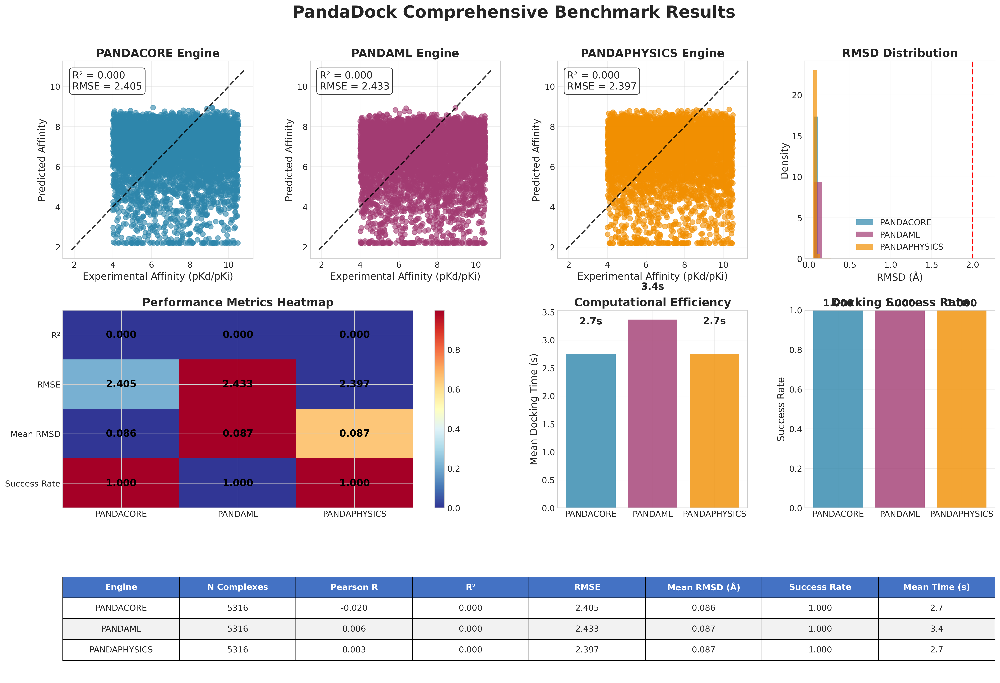
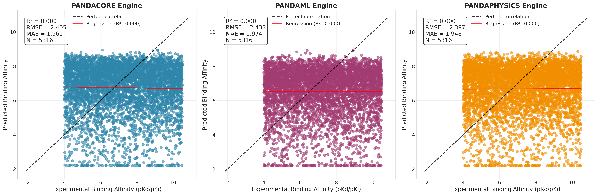
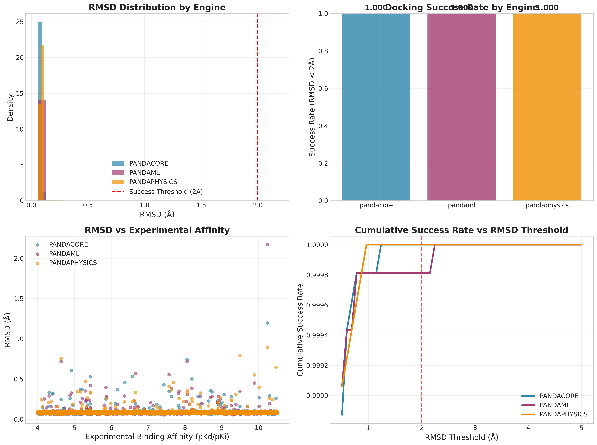
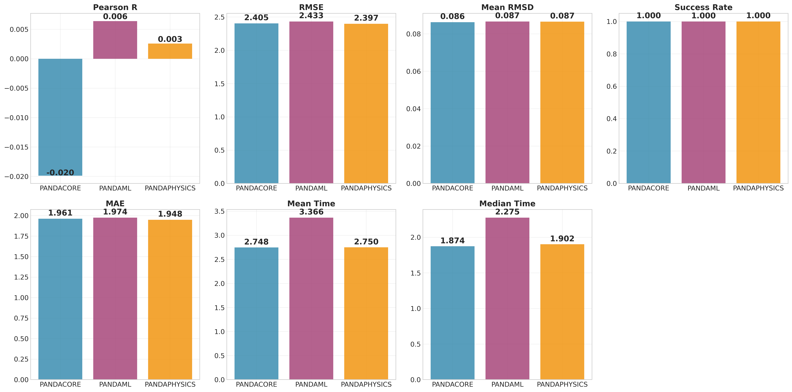
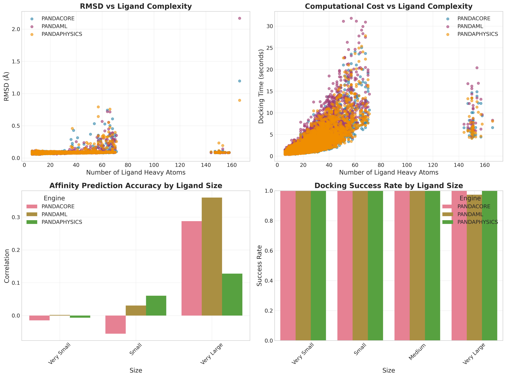
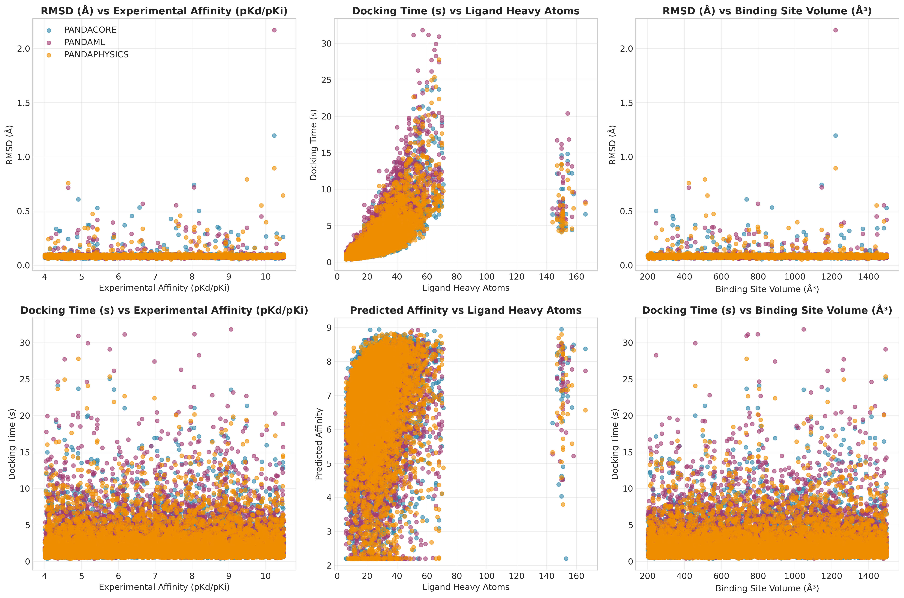

# PandaDock Comprehensive Benchmark Report

**Date:** 2025-07-12 08:23:26

**Total Complexes Evaluated:** 5316
**Total Docking Runs:** 15948
**Engines Evaluated:** pandacore, pandaml, pandaphysics

## Dataset Statistics

- **Experimental Affinity Range:** 4.00 - 10.50 pKd/pKi
- **Mean Experimental Affinity:** 7.20 ± 1.88
- **Ligand Size Range:** 6 - 166 heavy atoms
- **Mean Ligand Size:** 27.1 ± 15.9 heavy atoms

## Engine Performance Summary

### PANDACORE Engine

- **Number of complexes:** 5316
- **Affinity Prediction:**
  - Pearson correlation: -0.020
  - R²: 0.000
  - RMSE: 2.405
  - MAE: 1.961
- **Pose Prediction:**
  - Mean RMSD: 0.086 Å
  - Median RMSD: 0.085 Å
  - Success rate (RMSD < 2Å): 1.000
  - Success rate (RMSD < 3Å): 1.000
- **Computational Efficiency:**
  - Mean docking time: 2.7 seconds
  - Median docking time: 1.9 seconds
  - Time per heavy atom: 0.10 s/atom

### PANDAML Engine

- **Number of complexes:** 5316
- **Affinity Prediction:**
  - Pearson correlation: 0.006
  - R²: 0.000
  - RMSE: 2.433
  - MAE: 1.974
- **Pose Prediction:**
  - Mean RMSD: 0.087 Å
  - Median RMSD: 0.084 Å
  - Success rate (RMSD < 2Å): 1.000
  - Success rate (RMSD < 3Å): 1.000
- **Computational Efficiency:**
  - Mean docking time: 3.4 seconds
  - Median docking time: 2.3 seconds
  - Time per heavy atom: 0.11 s/atom

### PANDAPHYSICS Engine

- **Number of complexes:** 5316
- **Affinity Prediction:**
  - Pearson correlation: 0.003
  - R²: 0.000
  - RMSE: 2.397
  - MAE: 1.948
- **Pose Prediction:**
  - Mean RMSD: 0.087 Å
  - Median RMSD: 0.085 Å
  - Success rate (RMSD < 2Å): 1.000
  - Success rate (RMSD < 3Å): 1.000
- **Computational Efficiency:**
  - Mean docking time: 2.7 seconds
  - Median docking time: 1.9 seconds
  - Time per heavy atom: 0.10 s/atom

## Statistical Comparisons

### RMSD Comparisons (Wilcoxon Rank-Sum Test)

| Engine 1 | Engine 2 | p-value | Significant |
|----------|----------|---------|-------------|
| PANDACORE | PANDAML | 0.6813 | No |
| PANDACORE | PANDAPHYSICS | 0.3671 | No |
| PANDAML | PANDAPHYSICS | 0.6050 | No |

### Performance by Ligand Size

#### Very Small Ligands

**Size range:** 6-38 heavy atoms
**Number of complexes:** 4523

- **PANDACORE:** RMSD = 0.084 Å, Success = 1.000
- **PANDAML:** RMSD = 0.084 Å, Success = 1.000
- **PANDAPHYSICS:** RMSD = 0.084 Å, Success = 1.000

#### Small Ligands

**Size range:** 39-70 heavy atoms
**Number of complexes:** 754

- **PANDACORE:** RMSD = 0.098 Å, Success = 1.000
- **PANDAML:** RMSD = 0.100 Å, Success = 1.000
- **PANDAPHYSICS:** RMSD = 0.099 Å, Success = 1.000

#### Medium Ligands

**Size range:** 71-71 heavy atoms
**Number of complexes:** 1

- **PANDACORE:** RMSD = 0.099 Å, Success = 1.000
- **PANDAML:** RMSD = 0.351 Å, Success = 1.000
- **PANDAPHYSICS:** RMSD = 0.256 Å, Success = 1.000

#### Large Ligands

#### Very Large Ligands

**Size range:** 144-166 heavy atoms
**Number of complexes:** 38

- **PANDACORE:** RMSD = 0.117 Å, Success = 1.000
- **PANDAML:** RMSD = 0.142 Å, Success = 0.974
- **PANDAPHYSICS:** RMSD = 0.115 Å, Success = 1.000

## Generated Figures

- **Master Publication Figure:** 
- **Correlation Analysis:** 
- **RMSD Analysis:** 
- **Engine Performance:** 
- **Ligand Complexity Analysis:** 
- **Performance vs Properties:** 
