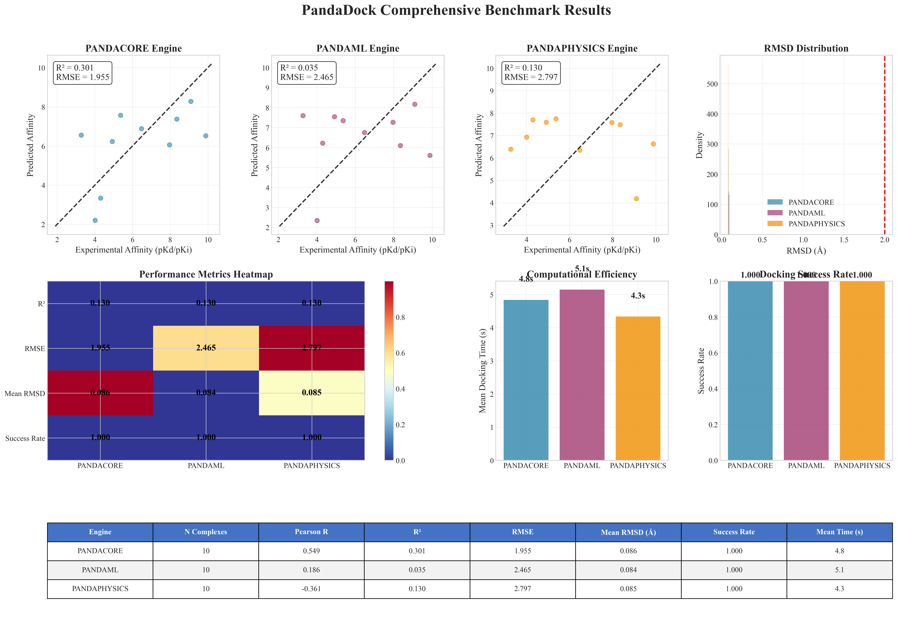
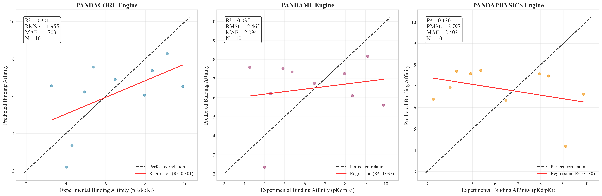
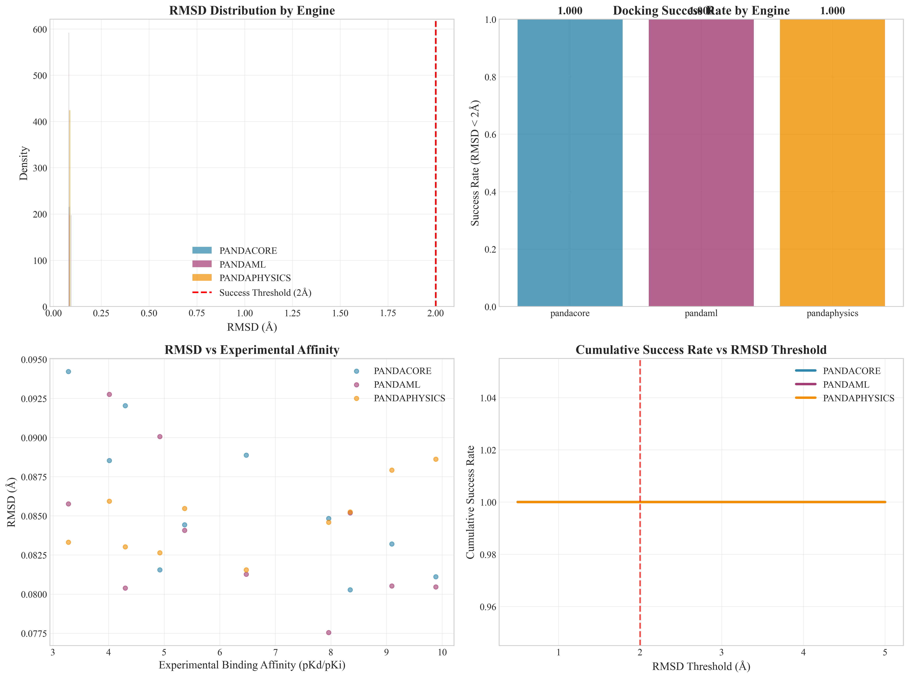
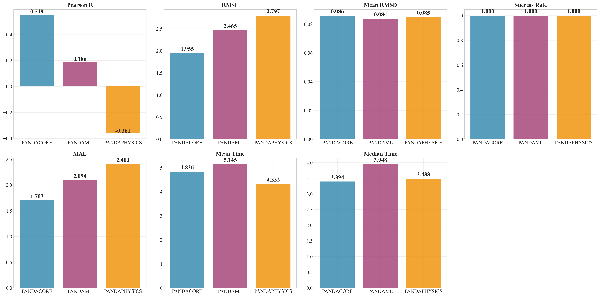
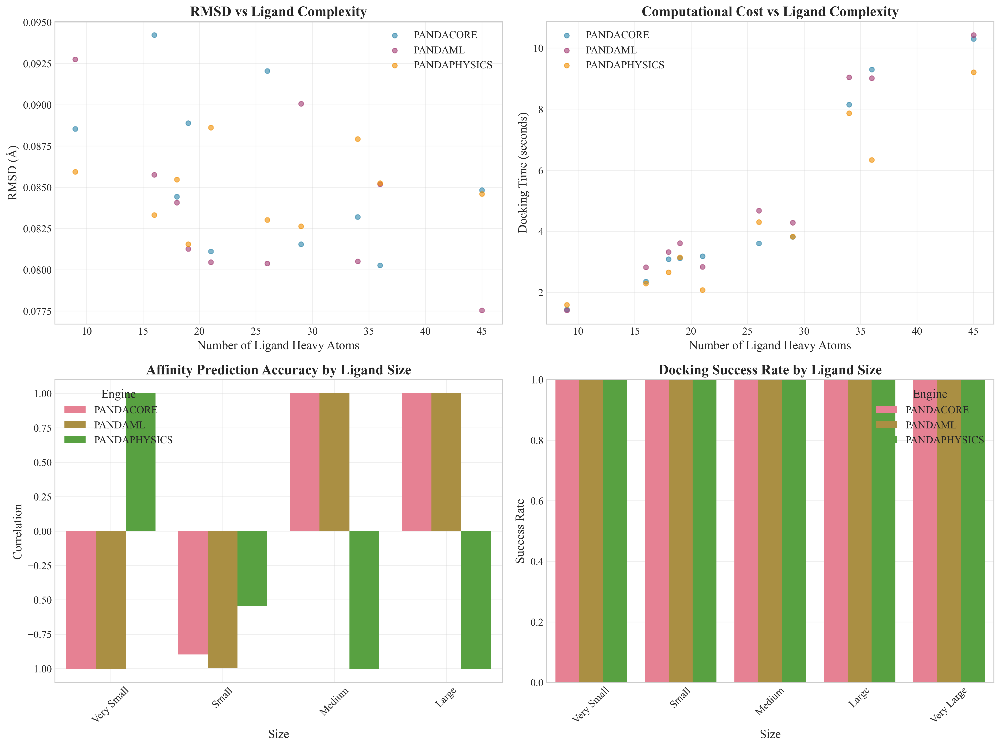
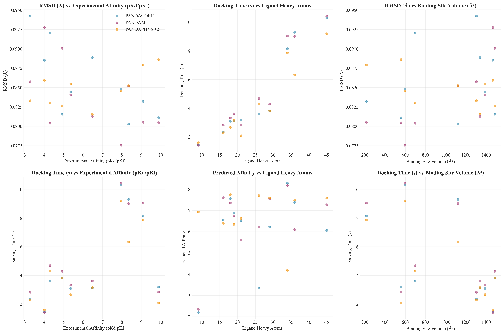

# PandaDock Comprehensive Benchmark Report

**Date:** 2025-07-12 10:20:42

**Total Complexes Evaluated:** 10
**Total Docking Runs:** 30
**Engines Evaluated:** pandacore, pandaml, pandaphysics

## Dataset Statistics

- **Experimental Affinity Range:** 3.28 - 9.89 pKd/pKi
- **Mean Experimental Affinity:** 6.36 ± 2.25
- **Ligand Size Range:** 9 - 45 heavy atoms
- **Mean Ligand Size:** 25.3 ± 10.5 heavy atoms

## Engine Performance Summary

### PANDACORE Engine

- **Number of complexes:** 10
- **Affinity Prediction:**
  - Pearson correlation: 0.549
  - R²: 0.301
  - RMSE: 1.955
  - MAE: 1.703
- **Pose Prediction:**
  - Mean RMSD: 0.086 Å
  - Median RMSD: 0.085 Å
  - Success rate (RMSD < 2Å): 1.000
  - Success rate (RMSD < 3Å): 1.000
- **Computational Efficiency:**
  - Mean docking time: 4.8 seconds
  - Median docking time: 3.4 seconds
  - Time per heavy atom: 0.18 s/atom

### PANDAML Engine

- **Number of complexes:** 10
- **Affinity Prediction:**
  - Pearson correlation: 0.186
  - R²: 0.035
  - RMSE: 2.465
  - MAE: 2.094
- **Pose Prediction:**
  - Mean RMSD: 0.084 Å
  - Median RMSD: 0.083 Å
  - Success rate (RMSD < 2Å): 1.000
  - Success rate (RMSD < 3Å): 1.000
- **Computational Efficiency:**
  - Mean docking time: 5.1 seconds
  - Median docking time: 3.9 seconds
  - Time per heavy atom: 0.19 s/atom

### PANDAPHYSICS Engine

- **Number of complexes:** 10
- **Affinity Prediction:**
  - Pearson correlation: -0.361
  - R²: 0.130
  - RMSE: 2.797
  - MAE: 2.403
- **Pose Prediction:**
  - Mean RMSD: 0.085 Å
  - Median RMSD: 0.085 Å
  - Success rate (RMSD < 2Å): 1.000
  - Success rate (RMSD < 3Å): 1.000
- **Computational Efficiency:**
  - Mean docking time: 4.3 seconds
  - Median docking time: 3.5 seconds
  - Time per heavy atom: 0.16 s/atom

## Statistical Comparisons

### RMSD Comparisons (Wilcoxon Rank-Sum Test)

| Engine 1 | Engine 2 | p-value | Significant |
|----------|----------|---------|-------------|
| PANDACORE | PANDAML | 0.3643 | No |
| PANDACORE | PANDAPHYSICS | 0.9397 | No |
| PANDAML | PANDAPHYSICS | 0.2899 | No |

### Performance by Ligand Size

#### Very Small Ligands

**Size range:** 9-16 heavy atoms
**Number of complexes:** 2

- **PANDACORE:** RMSD = 0.091 Å, Success = 1.000
- **PANDAML:** RMSD = 0.089 Å, Success = 1.000
- **PANDAPHYSICS:** RMSD = 0.085 Å, Success = 1.000

#### Small Ligands

**Size range:** 18-21 heavy atoms
**Number of complexes:** 3

- **PANDACORE:** RMSD = 0.085 Å, Success = 1.000
- **PANDAML:** RMSD = 0.082 Å, Success = 1.000
- **PANDAPHYSICS:** RMSD = 0.085 Å, Success = 1.000

#### Medium Ligands

**Size range:** 26-29 heavy atoms
**Number of complexes:** 2

- **PANDACORE:** RMSD = 0.087 Å, Success = 1.000
- **PANDAML:** RMSD = 0.085 Å, Success = 1.000
- **PANDAPHYSICS:** RMSD = 0.083 Å, Success = 1.000

#### Large Ligands

**Size range:** 34-36 heavy atoms
**Number of complexes:** 2

- **PANDACORE:** RMSD = 0.082 Å, Success = 1.000
- **PANDAML:** RMSD = 0.083 Å, Success = 1.000
- **PANDAPHYSICS:** RMSD = 0.087 Å, Success = 1.000

#### Very Large Ligands

**Size range:** 45-45 heavy atoms
**Number of complexes:** 1

- **PANDACORE:** RMSD = 0.085 Å, Success = 1.000
- **PANDAML:** RMSD = 0.078 Å, Success = 1.000
- **PANDAPHYSICS:** RMSD = 0.085 Å, Success = 1.000

## Generated Figures

- **Master Publication Figure:** 
- **Correlation Analysis:** 
- **RMSD Analysis:** 
- **Engine Performance:** 
- **Ligand Complexity Analysis:** 
- **Performance vs Properties:** 
