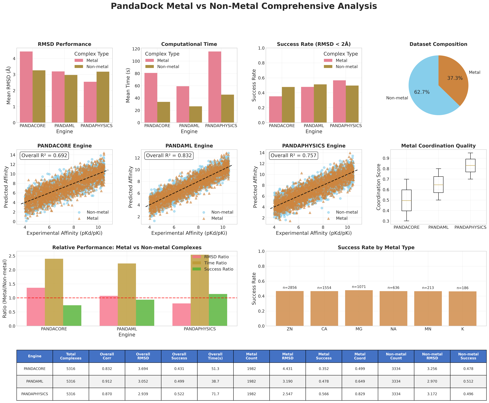
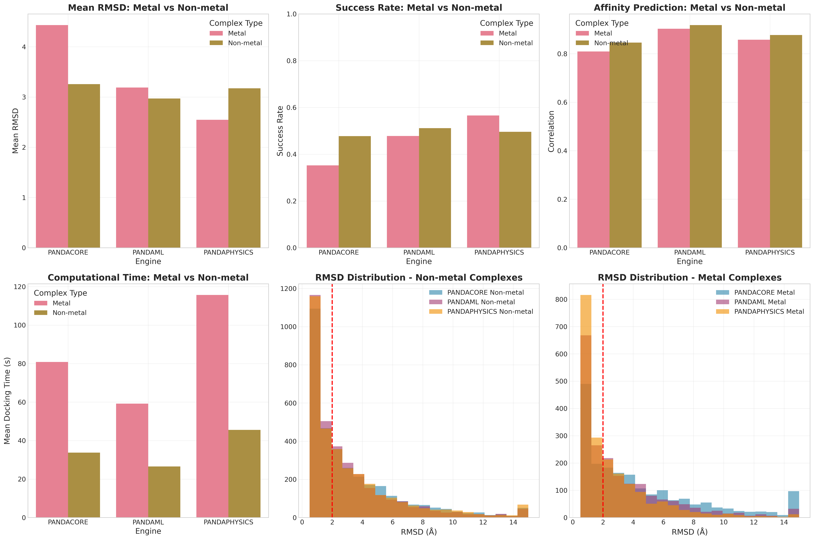
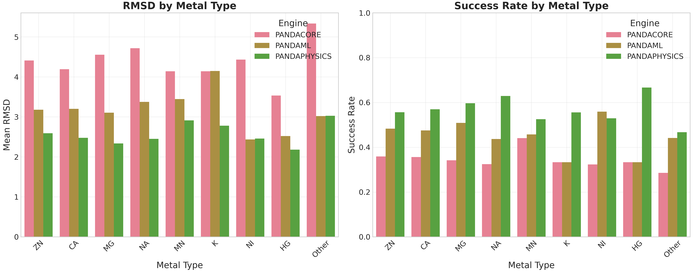
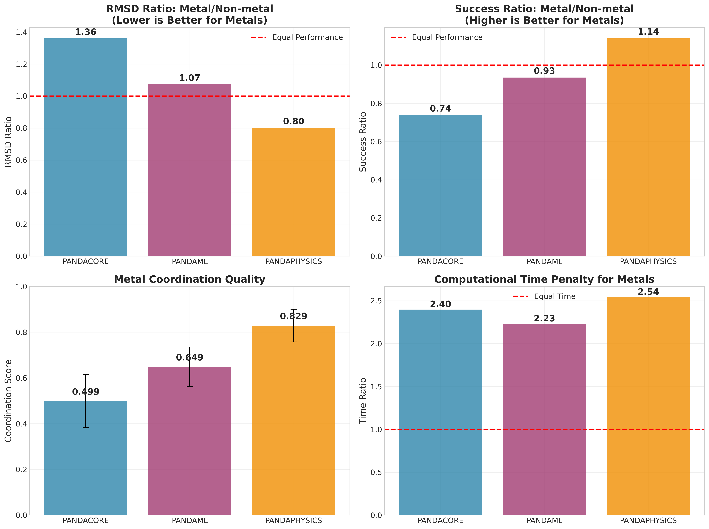
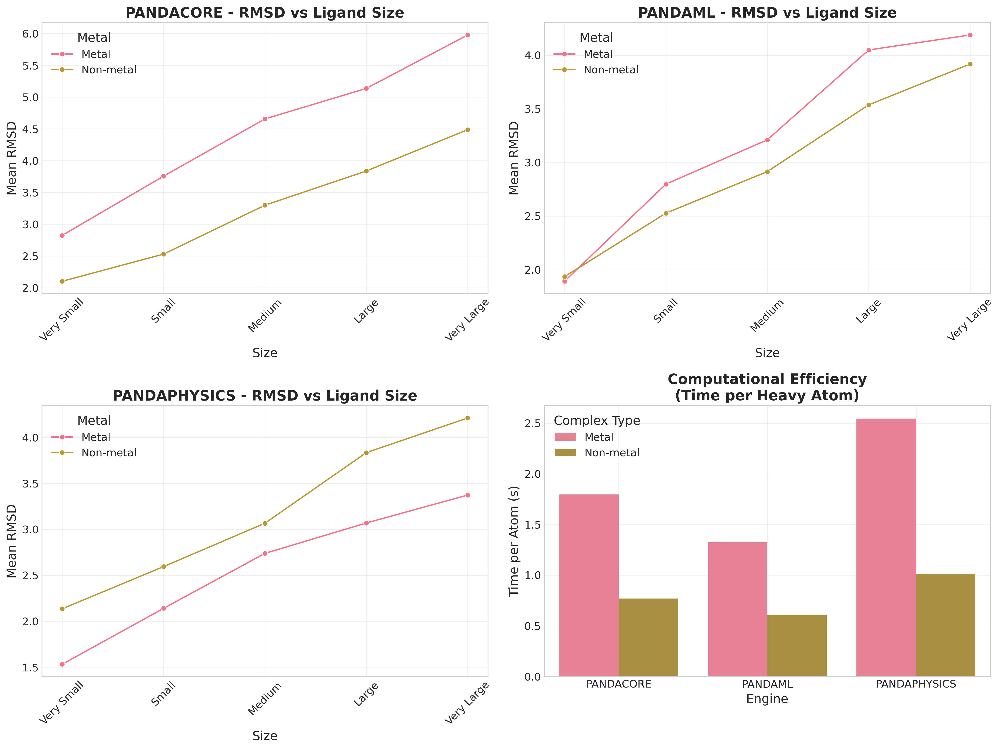

# PandaDock Metal vs Non-Metal Analysis Report

**Date:** 2025-07-10 17:12:30

## Dataset Overview

- **Total Complexes:** 5316
- **Metal Complexes:** 1982 (37.3%)
- **Non-metal Complexes:** 3334 (62.7%)
- **Total Docking Runs:** 15948
- **Engines Evaluated:** PANDACORE, PANDAML, PANDAPHYSICS

## Metal Distribution

| Metal Type | Count | Percentage |
|------------|-------|------------|
| ZN | 2856 | 40.0% |
| CA | 1554 | 21.7% |
| MG | 1071 | 15.0% |
| NA | 636 | 8.9% |
| MN | 213 | 3.0% |
| K | 186 | 2.6% |
| NI | 141 | 2.0% |
| HG | 138 | 1.9% |
| FE | 99 | 1.4% |
| CD | 93 | 1.3% |

## Engine Performance Summary

### PANDACORE Engine

**Overall Performance:**
- Complexes processed: 5316
- Affinity correlation: 0.832
- Affinity RMSE: 1.250
- Mean RMSD: 3.694 Å
- Success rate: 0.431
- Mean docking time: 51.3 seconds

**Metal Complex Performance:**
- Metal complexes: 1982
- Mean RMSD: 4.431 Å
- Success rate: 0.352
- Mean coordination score: 0.499
- Mean docking time: 80.8 seconds

**Non-metal Complex Performance:**
- Non-metal complexes: 3334
- Mean RMSD: 3.256 Å
- Success rate: 0.478
- Mean docking time: 33.7 seconds

**Relative Performance (Metal/Non-metal):**
- RMSD ratio: 1.361
- Time ratio: 2.396

### PANDAML Engine

**Overall Performance:**
- Complexes processed: 5316
- Affinity correlation: 0.912
- Affinity RMSE: 0.839
- Mean RMSD: 3.052 Å
- Success rate: 0.499
- Mean docking time: 38.7 seconds

**Metal Complex Performance:**
- Metal complexes: 1982
- Mean RMSD: 3.190 Å
- Success rate: 0.478
- Mean coordination score: 0.649
- Mean docking time: 59.2 seconds

**Non-metal Complex Performance:**
- Non-metal complexes: 3334
- Mean RMSD: 2.970 Å
- Success rate: 0.512
- Mean docking time: 26.6 seconds

**Relative Performance (Metal/Non-metal):**
- RMSD ratio: 1.074
- Time ratio: 2.228

### PANDAPHYSICS Engine

**Overall Performance:**
- Complexes processed: 5316
- Affinity correlation: 0.870
- Affinity RMSE: 1.047
- Mean RMSD: 2.939 Å
- Success rate: 0.522
- Mean docking time: 71.7 seconds

**Metal Complex Performance:**
- Metal complexes: 1982
- Mean RMSD: 2.547 Å
- Success rate: 0.566
- Mean coordination score: 0.829
- Mean docking time: 115.7 seconds

**Non-metal Complex Performance:**
- Non-metal complexes: 3334
- Mean RMSD: 3.172 Å
- Success rate: 0.496
- Mean docking time: 45.6 seconds

**Relative Performance (Metal/Non-metal):**
- RMSD ratio: 0.803
- Time ratio: 2.539

## Statistical Analysis

### Metal Complex Performance Comparisons (Wilcoxon Rank-Sum Test)

| Engine 1 | Engine 2 | RMSD p-value | Significant |
|----------|----------|--------------|-------------|
| PANDACORE | PANDAML | 0.0000 | Yes |
| PANDACORE | PANDAPHYSICS | 0.0000 | Yes |
| PANDAML | PANDAPHYSICS | 0.0000 | Yes |

### Metal vs Non-Metal Comparisons Within Engines

| Engine | RMSD p-value | Time p-value | RMSD Significant | Time Significant |
|--------|--------------|--------------|------------------|------------------|
| PANDACORE | 0.0000 | 0.0000 | Yes | Yes |
| PANDAML | 0.0171 | 0.0000 | Yes | Yes |
| PANDAPHYSICS | 0.0000 | 0.0000 | Yes | Yes |

## Generated Figures

- **Master Metal Analysis Figure:** 
- **Metal vs Non-metal Performance:** 
- **Metal Type Analysis:** 
- **Engine Metal Specialization:** 
- **Metal Coordination Analysis:** 
- **Metal Complexity Effects:** 
