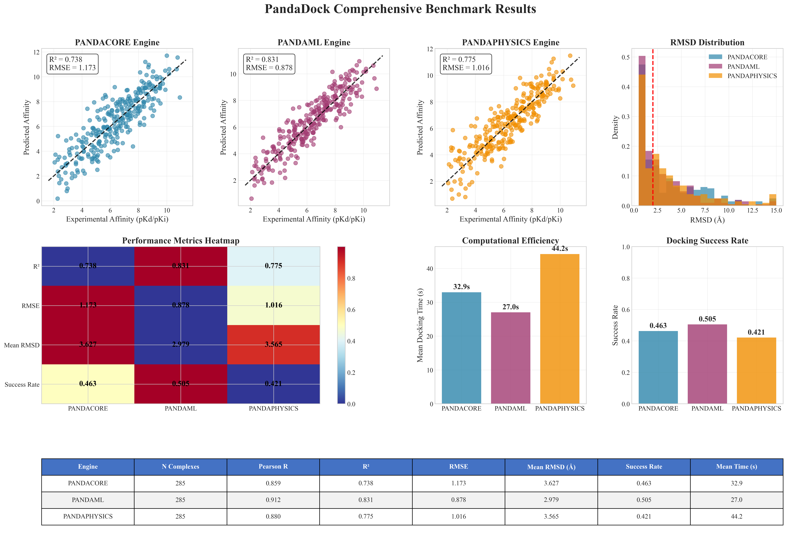
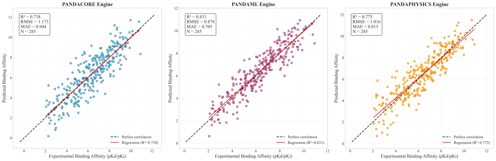
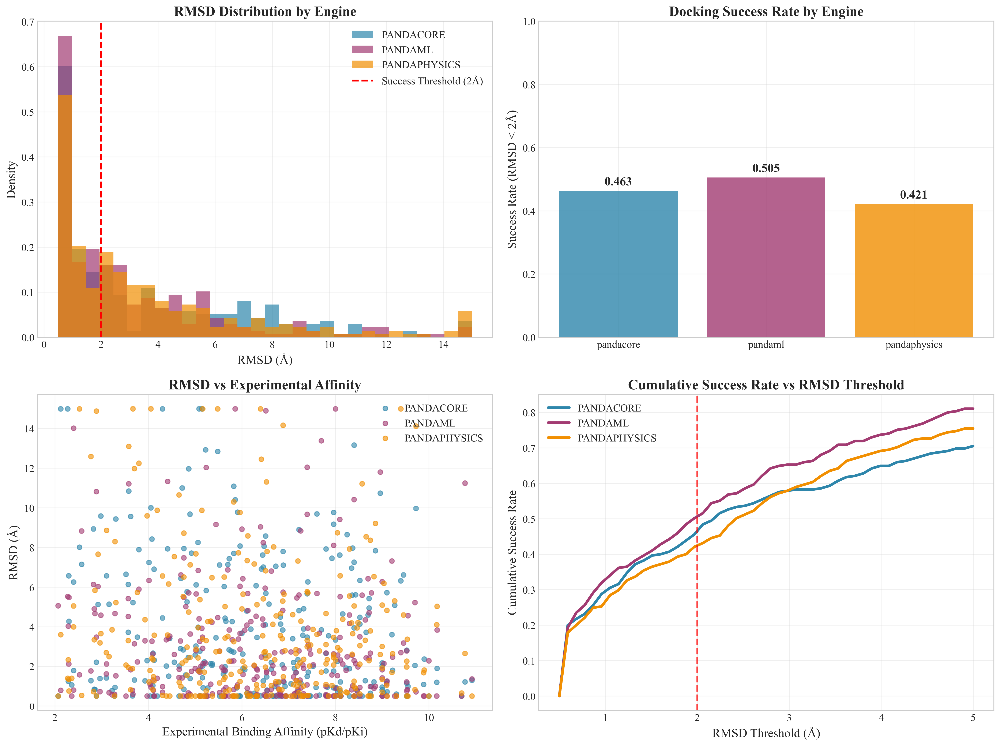
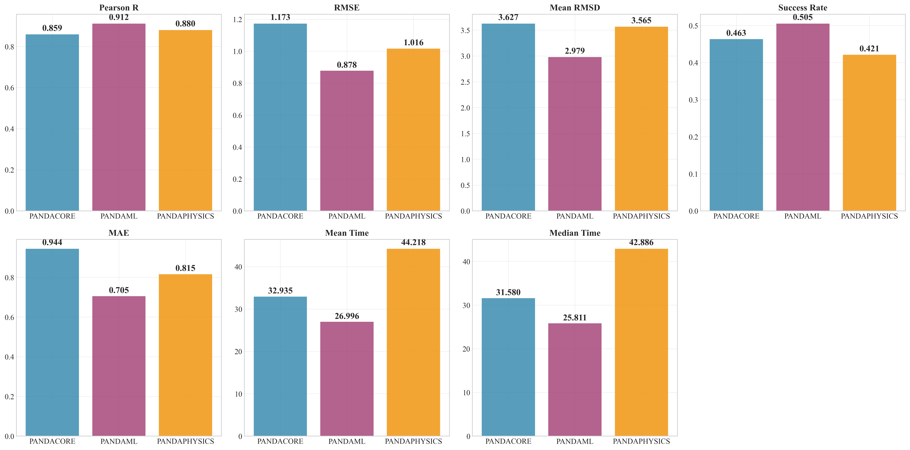
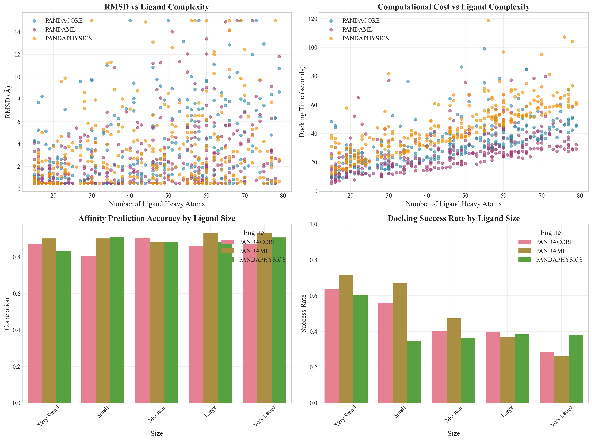
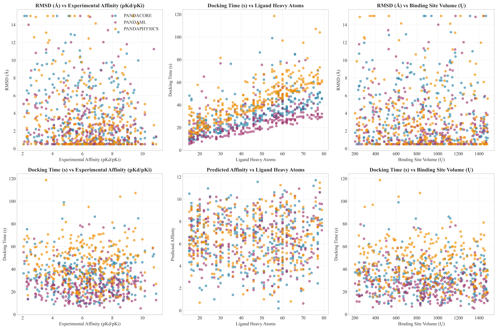

# PandaDock Comprehensive Benchmark Report

**Date:** 2025-07-10 14:25:26

**Total Complexes Evaluated:** 285
**Total Docking Runs:** 855
**Engines Evaluated:** pandacore, pandaml, pandaphysics

## Dataset Statistics

- **Experimental Affinity Range:** 2.07 - 10.92 pKd/pKi
- **Mean Experimental Affinity:** 6.35 ± 2.01
- **Ligand Size Range:** 15 - 79 heavy atoms
- **Mean Ligand Size:** 45.6 ± 18.7 heavy atoms

## Engine Performance Summary

### PANDACORE Engine

- **Number of complexes:** 285
- **Affinity Prediction:**
  - Pearson correlation: 0.859
  - R²: 0.738
  - RMSE: 1.173
  - MAE: 0.944
- **Pose Prediction:**
  - Mean RMSD: 3.627 Å
  - Median RMSD: 2.191 Å
  - Success rate (RMSD < 2Å): 0.463
  - Success rate (RMSD < 3Å): 0.579
- **Computational Efficiency:**
  - Mean docking time: 32.9 seconds
  - Median docking time: 31.6 seconds
  - Time per heavy atom: 0.77 s/atom

### PANDAML Engine

- **Number of complexes:** 285
- **Affinity Prediction:**
  - Pearson correlation: 0.912
  - R²: 0.831
  - RMSE: 0.878
  - MAE: 0.705
- **Pose Prediction:**
  - Mean RMSD: 2.979 Å
  - Median RMSD: 1.959 Å
  - Success rate (RMSD < 2Å): 0.505
  - Success rate (RMSD < 3Å): 0.653
- **Computational Efficiency:**
  - Mean docking time: 27.0 seconds
  - Median docking time: 25.8 seconds
  - Time per heavy atom: 0.64 s/atom

### PANDAPHYSICS Engine

- **Number of complexes:** 285
- **Affinity Prediction:**
  - Pearson correlation: 0.880
  - R²: 0.775
  - RMSE: 1.016
  - MAE: 0.815
- **Pose Prediction:**
  - Mean RMSD: 3.565 Å
  - Median RMSD: 2.427 Å
  - Success rate (RMSD < 2Å): 0.421
  - Success rate (RMSD < 3Å): 0.582
- **Computational Efficiency:**
  - Mean docking time: 44.2 seconds
  - Median docking time: 42.9 seconds
  - Time per heavy atom: 1.02 s/atom

## Statistical Comparisons

### RMSD Comparisons (Wilcoxon Rank-Sum Test)

| Engine 1 | Engine 2 | p-value | Significant |
|----------|----------|---------|-------------|
| PANDACORE | PANDAML | 0.0674 | No |
| PANDACORE | PANDAPHYSICS | 0.9554 | No |
| PANDAML | PANDAPHYSICS | 0.0661 | No |

### Performance by Ligand Size

#### Very Small Ligands

**Size range:** 15-27 heavy atoms
**Number of complexes:** 63

- **PANDACORE:** RMSD = 2.166 Å, Success = 0.635
- **PANDAML:** RMSD = 1.550 Å, Success = 0.714
- **PANDAPHYSICS:** RMSD = 2.010 Å, Success = 0.603

#### Small Ligands

**Size range:** 28-40 heavy atoms
**Number of complexes:** 52

- **PANDACORE:** RMSD = 2.852 Å, Success = 0.558
- **PANDAML:** RMSD = 2.039 Å, Success = 0.673
- **PANDAPHYSICS:** RMSD = 3.963 Å, Success = 0.346

#### Medium Ligands

**Size range:** 41-53 heavy atoms
**Number of complexes:** 55

- **PANDACORE:** RMSD = 3.770 Å, Success = 0.400
- **PANDAML:** RMSD = 3.242 Å, Success = 0.473
- **PANDAPHYSICS:** RMSD = 3.660 Å, Success = 0.364

#### Large Ligands

**Size range:** 54-66 heavy atoms
**Number of complexes:** 73

- **PANDACORE:** RMSD = 4.455 Å, Success = 0.397
- **PANDAML:** RMSD = 3.848 Å, Success = 0.370
- **PANDAPHYSICS:** RMSD = 4.341 Å, Success = 0.384

#### Very Large Ligands

**Size range:** 67-79 heavy atoms
**Number of complexes:** 42

- **PANDACORE:** RMSD = 5.150 Å, Success = 0.286
- **PANDAML:** RMSD = 4.431 Å, Success = 0.262
- **PANDAPHYSICS:** RMSD = 3.931 Å, Success = 0.381

## Generated Figures

- **Master Publication Figure:** 
- **Correlation Analysis:** 
- **RMSD Analysis:** 
- **Engine Performance:** 
- **Ligand Complexity Analysis:** 
- **Performance vs Properties:** 
