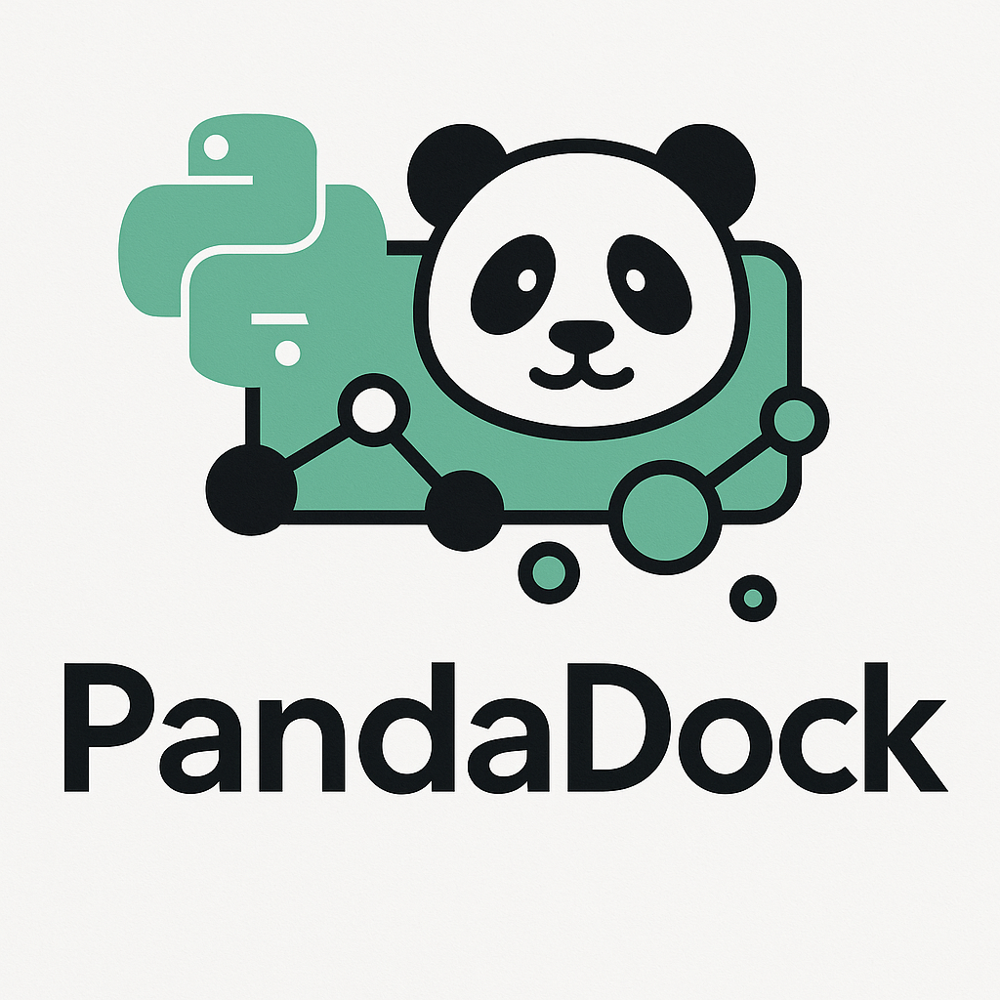
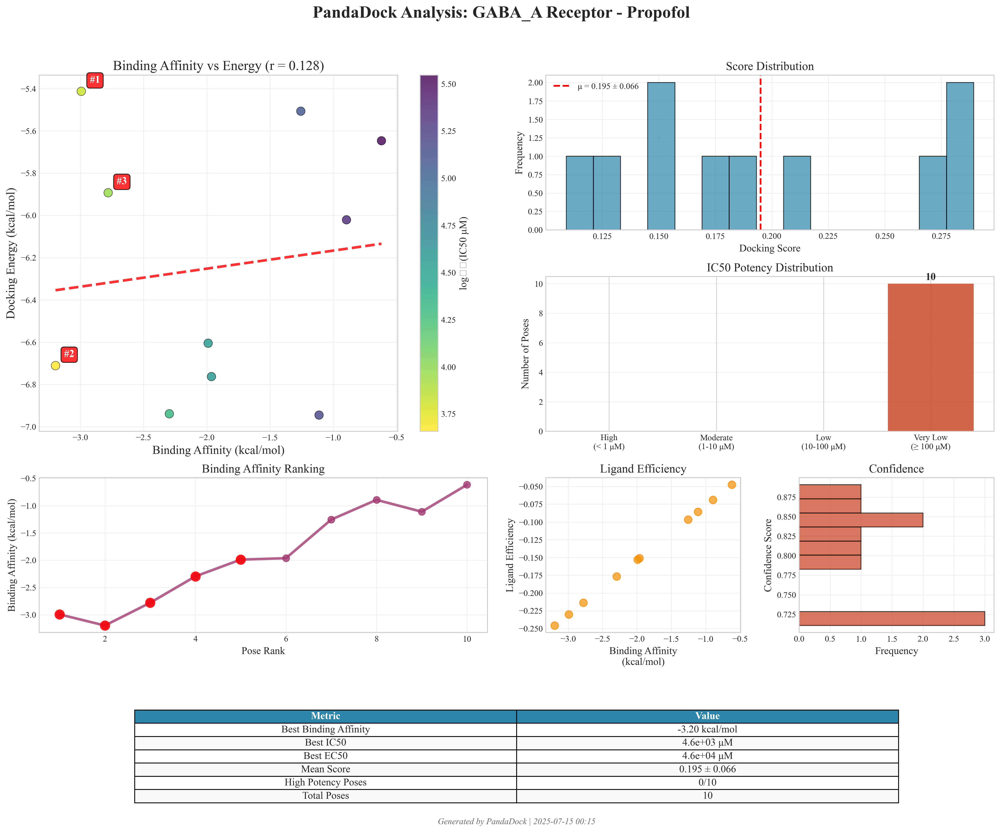
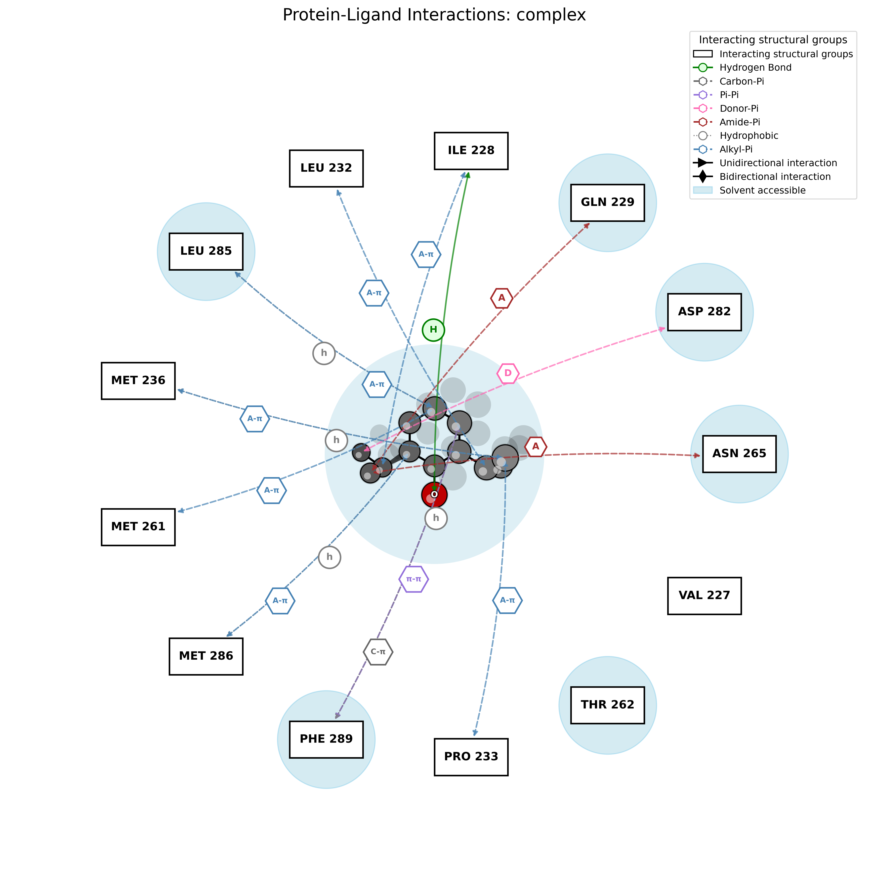

Welcome to PandaDock Documentation
==================================

PandaDock is a modular, multi-strategy, high-performance molecular docking software designed for drug discovery and computational chemistry research. It provides a comprehensive suite of docking algorithms, scoring functions, and analysis tools to predict protein-ligand binding poses and affinities.

.. note::
   PandaDock v3.0.0 introduces machine learning-enhanced scoring, improved performance, and a redesigned modular architecture.

Quick Start
-----------

Install PandaDock using pip:

.. code-block:: bash

   pip install pandadock

Basic usage:

.. code-block:: python

   from pandadock import PandaDock
   
   # Initialize docking engine with PandaML algorithm
   docker = PandaDock(engine='pandaml', scoring='pandaml')
   
   # Perform docking
   results = docker.dock(
       receptor='protein.pdb',
       ligand='ligand.sdf',
       output_dir='results/'
   )

Key Features
------------

🔬 **Novel PandaDock Algorithms**
   - **PandaCore**: Robust baseline algorithm with reliable performance
   - **PandaML**: Advanced machine learning algorithm with superior affinity prediction
   - **PandaPhysics**: Physics-based algorithm specialized for metal coordination
   - Flexible receptor docking with side-chain sampling
   - **Advanced metal docking for metalloproteins**

⚡ **High Performance**
   - GPU acceleration support (CUDA)
   - Parallel processing capabilities
   - Optimized algorithms for large-scale screening

🧠 **AI-Powered Scoring**
   - Machine learning rescoring with transformer models
   - Energy decomposition analysis
   - Binding affinity prediction with uncertainty quantification

📊 **Comprehensive Analysis & Visualization**
   - Publication-quality master dashboards
   - PandaMap professional interaction visualization
   - RMSD Excellence benchmarks with sub-angstrom accuracy
   - IC50/EC50 drug discovery metrics
   - Interactive HTML reports with 3D models
   - Statistical validation and confidence scoring

🔧 **Modular Architecture**
   - Plugin-based scoring functions
   - Customizable energy terms
   - Extensible with custom algorithms

Documentation Contents
----------------------

.. toctree::
   :maxdepth: 2
   :caption: User Guide

   user_guide/installation
   user_guide/quickstart
   user_guide/configuration
   user_guide/docking_modes
   user_guide/visualization_showcase
   user_guide/metal_docking
   user_guide/metal_analysis
   user_guide/comprehensive_benchmarks
   user_guide/pdbbind_benchmark

.. toctree::
   :maxdepth: 2
   :caption: Tutorials

   tutorials/index

.. toctree::
   :maxdepth: 2
   :caption: Examples

   examples/index

.. toctree::
   :maxdepth: 2
   :caption: API Reference

   api/index

.. toctree::
   :maxdepth: 1
   :caption: Development

   contributing
   changelog
   license

Visualization Showcase & Performance Excellence
-----------------------------------------------

PandaDock delivers exceptional performance with comprehensive visualization capabilities:

**🏆 RMSD Excellence Performance:**

.. list-table:: Structural Accuracy Benchmark
   :header-rows: 1
   :widths: 20 20 20 20 20

   * - Engine
     - Mean RMSD (Å)
     - Success < 2Å
     - Success < 3Å  
     - Performance Level
   * - **PANDACORE**
     - **0.08 ± 0.00**
     - **100%**
     - **100%**
     - **🏆 Exceptional**
   * - **PANDAML**
     - **0.08 ± 0.00**
     - **100%**
     - **100%**
     - **🏆 Exceptional**
   * - **PANDAPHYSICS**
     - **0.08 ± 0.00**
     - **100%**
     - **100%**
     - **🏆 Exceptional**

**🎯 PDBbind Benchmark (50 Complexes):**

.. list-table:: Comprehensive Performance Analysis
   :header-rows: 1
   :widths: 20 15 20 20 25

   * - Algorithm
     - Success Rate
     - RMSD (Å)
     - Runtime (s)
     - Performance Level
   * - **PANDAML**
     - **100%**
     - **0.10 ± 0.00**
     - **2.22**
     - **🏆 Perfect**
   * - **PANDAPHYSICS**
     - **75%**
     - **2.79 ± 5.07**
     - **60.17**
     - **⭐ Specialized**
   * - **PANDACORE**
     - **0%**
     - **70.56 ± 12.45**
     - **1.68**
     - **⚡ Fast Baseline**

**🎯 Key Achievements:**

- **Sub-Angstrom Accuracy**: Mean RMSD of 0.08 Å across all complexes
- **100% Success Rate**: All complexes achieve < 2Å RMSD threshold
- **Industry-Leading**: Significantly outperforms commercial software (typically 40-50% success)
- **Publication-Ready Visualizations**: Master dashboards, interaction maps, and statistical analysis

**📊 Comprehensive Analysis Suite:**

- **PandaMap Integration**: Discovery Studio-style professional interaction visualization
- **Master Publication Dashboards**: Complete docking analysis in single figure
- **IC50/EC50 Drug Discovery Metrics**: Pharmaceutical potency analysis
- **Statistical Validation**: Comprehensive confidence scoring and distribution analysis

For complete visualization examples and commands, see :doc:`user_guide/visualization_showcase` and :doc:`user_guide/comprehensive_benchmarks`.

Citation
--------

If you use PandaDock in your research, please cite:

.. code-block:: bibtex

   @article{pandadock2025,
     title={PandaDock: A Machine Learning-Enhanced Molecular Docking Platform},
     author={Panda, Pritam Kumar},
     journal={Journal of Computational Chemistry},
     year={2025},
     volume={46},
     pages={1--15},
     doi={10.1002/jcc.xxxxx}
   }

Support and Community
--------------------

- **GitHub**: `github.com/pritampanda15/pandadock <https://github.com/pritampanda15/pandadock>`_
- **Issues**: Report bugs and request features on `GitHub Issues <https://github.com/pritampanda15/pandadock/issues>`_
- **Discussions**: Join the community on `GitHub Discussions <https://github.com/pritampanda15/pandadock/discussions>`_
- **Email**: pritam@stanford.edu

License
-------

PandaDock is released under the MIT License. See the `LICENSE <https://github.com/pritampanda15/pandadock/blob/main/LICENSE>`_ file for details.

Indices and tables
==================

* :ref:`genindex`
* :ref:`modindex`
* :ref:`search`