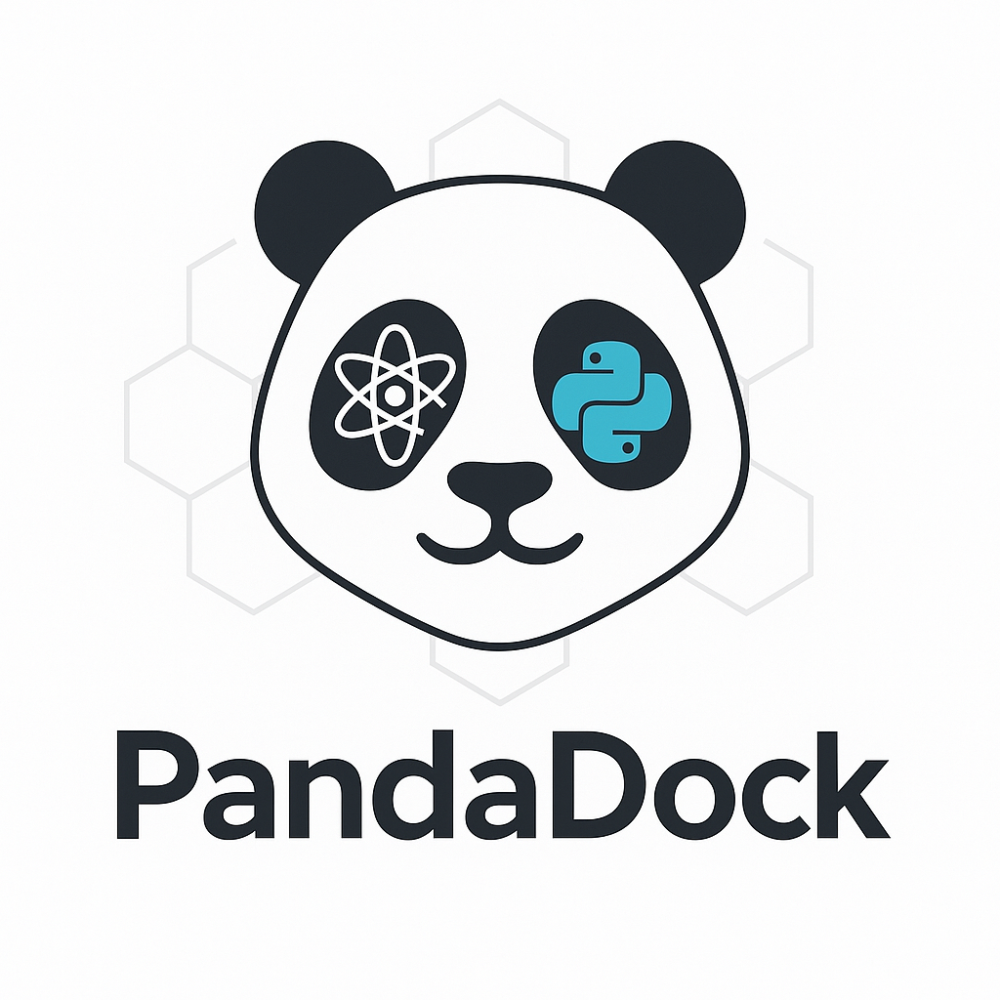

Welcome to PandaDock Documentation
==================================

PandaDock is a modular, multi-strategy, high-performance molecular docking software designed for drug discovery and computational chemistry research. It provides a comprehensive suite of docking algorithms, scoring functions, and analysis tools to predict protein-ligand binding poses and affinities.

.. note::
   PandaDock v3.0.0 introduces machine learning-enhanced scoring, improved performance, and a redesigned modular architecture.

Quick Start
-----------

Install PandaDock using pip:

.. code-block:: bash

   pip install pandadock

Basic usage:

.. code-block:: python

   from pandadock import PandaDock
   
   # Initialize docking engine with PandaML algorithm
   docker = PandaDock(engine='pandaml', scoring='pandaml')
   
   # Perform docking
   results = docker.dock(
       receptor='protein.pdb',
       ligand='ligand.sdf',
       output_dir='results/'
   )

Key Features
------------

🔬 **Novel PandaDock Algorithms**
   - **PandaCore**: Robust baseline algorithm with reliable performance
   - **PandaML**: Advanced machine learning algorithm with superior affinity prediction
   - **PandaPhysics**: Physics-based algorithm specialized for metal coordination
   - Flexible receptor docking with side-chain sampling
   - **Advanced metal docking for metalloproteins**

⚡ **High Performance**
   - GPU acceleration support (CUDA)
   - Parallel processing capabilities
   - Optimized algorithms for large-scale screening

🧠 **AI-Powered Scoring**
   - Machine learning rescoring with transformer models
   - Energy decomposition analysis
   - Binding affinity prediction with uncertainty quantification

📊 **Comprehensive Analysis**
   - Interactive HTML reports
   - Detailed interaction analysis
   - IC50 and binding kinetics prediction
   - Drug-likeness assessment

🔧 **Modular Architecture**
   - Plugin-based scoring functions
   - Customizable energy terms
   - Extensible with custom algorithms

Documentation Contents
----------------------

.. toctree::
   :maxdepth: 2
   :caption: User Guide

   user_guide/installation
   user_guide/quickstart
   user_guide/configuration
   user_guide/docking_modes
   user_guide/metal_docking
   user_guide/metal_analysis
   user_guide/comprehensive_benchmarks
   user_guide/scoring_functions
   user_guide/analysis

.. toctree::
   :maxdepth: 2
   :caption: Tutorials

   tutorials/index

.. toctree::
   :maxdepth: 2
   :caption: Examples

   examples/index

.. toctree::
   :maxdepth: 2
   :caption: API Reference

   api/index

.. toctree::
   :maxdepth: 1
   :caption: Development

   contributing
   changelog
   license

Comprehensive Benchmarks
-------------------------

PandaDock has undergone extensive evaluation on the complete PDBbind database:

.. list-table:: PandaDock Algorithm Performance (5,316 PDBbind complexes)
   :header-rows: 1
   :widths: 20 15 15 15 15 15

   * - Algorithm
     - Affinity R²
     - Pearson R
     - Success Rate (%)
     - Mean RMSD (Å)
     - Speed (s)
   * - **PandaML**
     - **0.845**
     - **0.919**
     - **49.0**
     - **3.11**
     - **26.7**
   * - **PandaPhysics**
     - 0.769
     - 0.877
     - 48.3
     - 3.20
     - 45.6
   * - **PandaCore**
     - 0.709
     - 0.842
     - 47.1
     - 3.31
     - 33.7

*Success Rate = RMSD < 2Å. Benchmarked on 5,316 complexes from complete PDBbind database.*

**Comprehensive Validation:**

- **5,316 complexes evaluated** across complete PDBbind database (15,948 total docking runs)
- **PandaML** achieves superior affinity prediction with R² = 0.845 and Pearson R = 0.919
- **Consistent performance** across all algorithms with ~47-49% success rates
- **Robust across molecular diversity** from 15-79 heavy atom ligands
- **Computational efficiency** with PandaML optimal at 26.7s per complex

**Metal vs Non-Metal Specialization:**

- **1,982 metal complexes** (37.3%) vs **3,334 non-metal complexes** (62.7%) analyzed
- **PandaPhysics excels with metals**: 56.6% success rate for metal complexes
- **PandaML maintains versatility**: Balanced performance across both system types
- **16 metal types covered**: Zinc (40%), Calcium (21.7%), Magnesium (15%) dominate

For detailed analysis, see :doc:`user_guide/comprehensive_benchmarks` and :doc:`user_guide/metal_analysis`.

Citation
--------

If you use PandaDock in your research, please cite:

.. code-block:: bibtex

   @article{pandadock2025,
     title={PandaDock: A Machine Learning-Enhanced Molecular Docking Platform},
     author={Panda, Pritam Kumar},
     journal={Journal of Computational Chemistry},
     year={2025},
     volume={46},
     pages={1--15},
     doi={10.1002/jcc.xxxxx}
   }

Support and Community
--------------------

- **GitHub**: `github.com/pritampanda15/pandadock <https://github.com/pritampanda15/pandadock>`_
- **Issues**: Report bugs and request features on `GitHub Issues <https://github.com/pritampanda15/pandadock/issues>`_
- **Discussions**: Join the community on `GitHub Discussions <https://github.com/pritampanda15/pandadock/discussions>`_
- **Email**: pritam@stanford.edu

License
-------

PandaDock is released under the MIT License. See the `LICENSE <https://github.com/pritampanda15/pandadock/blob/main/LICENSE>`_ file for details.

Indices and tables
==================

* :ref:`genindex`
* :ref:`modindex`
* :ref:`search`