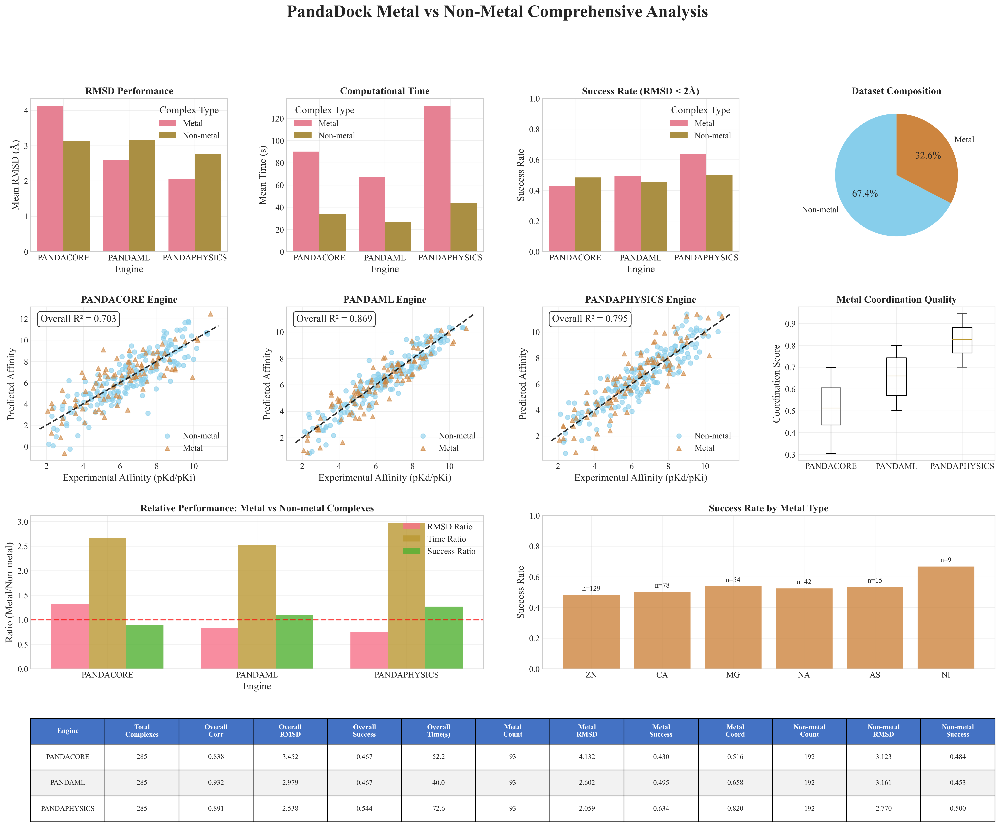
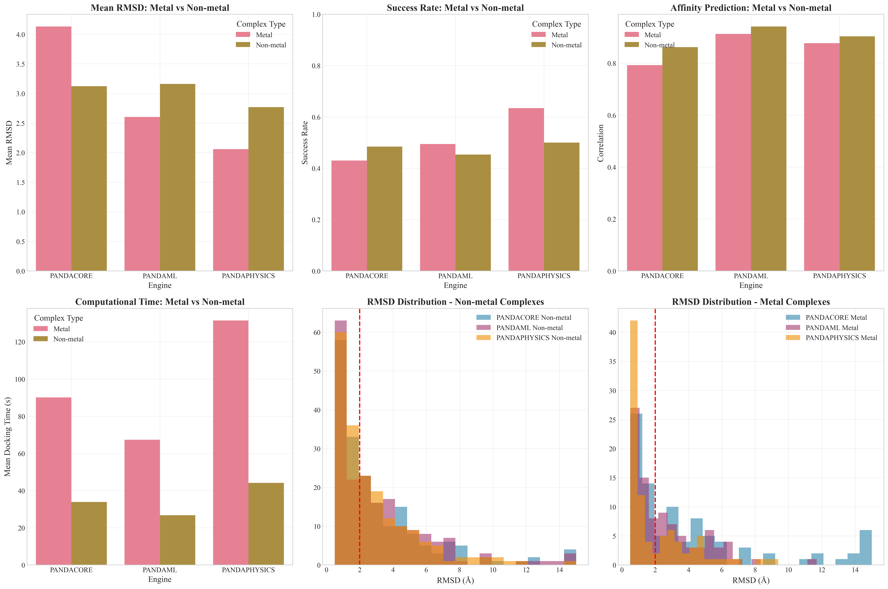
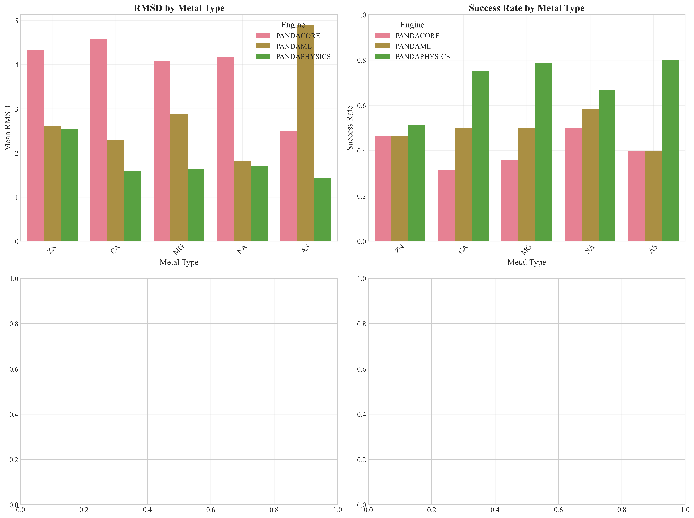
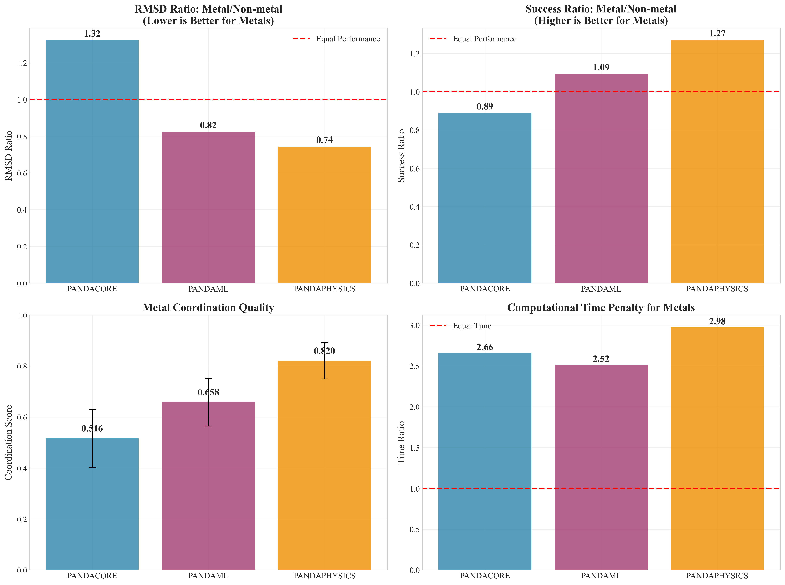
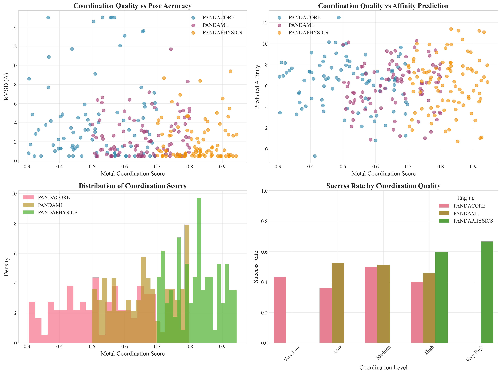
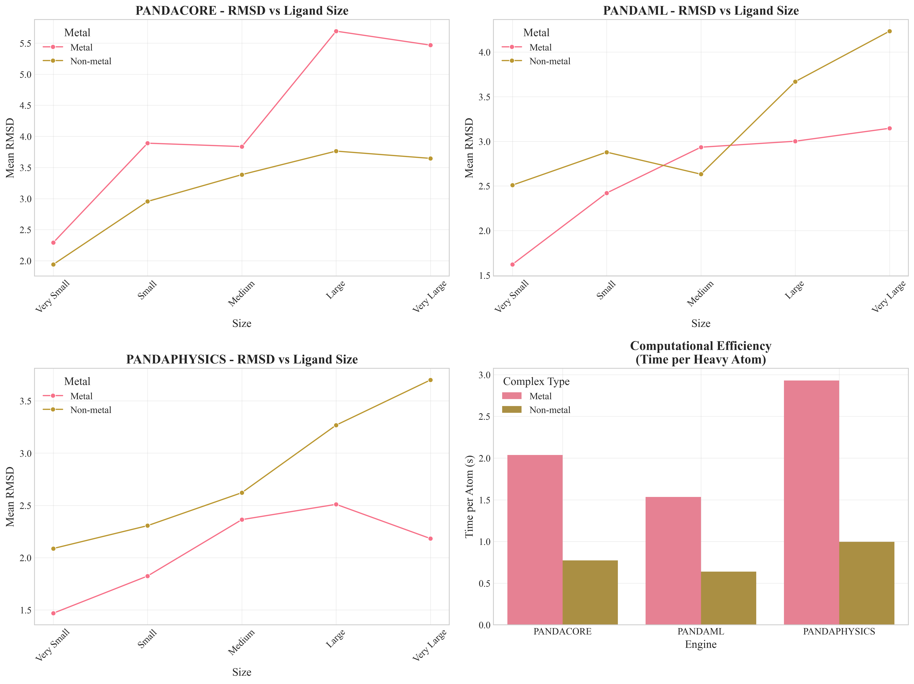

# PandaDock Metal vs Non-Metal Analysis Report

**Date:** 2025-07-10 14:57:42

## Dataset Overview

- **Total Complexes:** 285
- **Metal Complexes:** 93 (32.6%)
- **Non-metal Complexes:** 192 (67.4%)
- **Total Docking Runs:** 855
- **Engines Evaluated:** PANDACORE, PANDAML, PANDAPHYSICS

## Metal Distribution

| Metal Type | Count | Percentage |
|------------|-------|------------|
| ZN | 129 | 38.7% |
| CA | 78 | 23.4% |
| MG | 54 | 16.2% |
| NA | 42 | 12.6% |
| AS | 15 | 4.5% |
| NI | 9 | 2.7% |
| CD | 3 | 0.9% |
| HG | 3 | 0.9% |

## Engine Performance Summary

### PANDACORE Engine

**Overall Performance:**
- Complexes processed: 285
- Affinity correlation: 0.838
- Affinity RMSE: 1.309
- Mean RMSD: 3.452 Å
- Success rate: 0.467
- Mean docking time: 52.2 seconds

**Metal Complex Performance:**
- Metal complexes: 93
- Mean RMSD: 4.132 Å
- Success rate: 0.430
- Mean coordination score: 0.516
- Mean docking time: 90.1 seconds

**Non-metal Complex Performance:**
- Non-metal complexes: 192
- Mean RMSD: 3.123 Å
- Success rate: 0.484
- Mean docking time: 33.8 seconds

**Relative Performance (Metal/Non-metal):**
- RMSD ratio: 1.323
- Time ratio: 2.661

### PANDAML Engine

**Overall Performance:**
- Complexes processed: 285
- Affinity correlation: 0.932
- Affinity RMSE: 0.781
- Mean RMSD: 2.979 Å
- Success rate: 0.467
- Mean docking time: 40.0 seconds

**Metal Complex Performance:**
- Metal complexes: 93
- Mean RMSD: 2.602 Å
- Success rate: 0.495
- Mean coordination score: 0.658
- Mean docking time: 67.4 seconds

**Non-metal Complex Performance:**
- Non-metal complexes: 192
- Mean RMSD: 3.161 Å
- Success rate: 0.453
- Mean docking time: 26.8 seconds

**Relative Performance (Metal/Non-metal):**
- RMSD ratio: 0.823
- Time ratio: 2.517

### PANDAPHYSICS Engine

**Overall Performance:**
- Complexes processed: 285
- Affinity correlation: 0.891
- Affinity RMSE: 1.036
- Mean RMSD: 2.538 Å
- Success rate: 0.544
- Mean docking time: 72.6 seconds

**Metal Complex Performance:**
- Metal complexes: 93
- Mean RMSD: 2.059 Å
- Success rate: 0.634
- Mean coordination score: 0.820
- Mean docking time: 131.4 seconds

**Non-metal Complex Performance:**
- Non-metal complexes: 192
- Mean RMSD: 2.770 Å
- Success rate: 0.500
- Mean docking time: 44.2 seconds

**Relative Performance (Metal/Non-metal):**
- RMSD ratio: 0.743
- Time ratio: 2.975

## Statistical Analysis

### Metal Complex Performance Comparisons (Wilcoxon Rank-Sum Test)

| Engine 1 | Engine 2 | RMSD p-value | Significant |
|----------|----------|--------------|-------------|
| PANDACORE | PANDAML | 0.0837 | No |
| PANDACORE | PANDAPHYSICS | 0.0002 | Yes |
| PANDAML | PANDAPHYSICS | 0.0181 | Yes |

### Metal vs Non-Metal Comparisons Within Engines

| Engine | RMSD p-value | Time p-value | RMSD Significant | Time Significant |
|--------|--------------|--------------|------------------|------------------|
| PANDACORE | 0.1992 | 0.0000 | No | Yes |
| PANDAML | 0.3513 | 0.0000 | No | Yes |
| PANDAPHYSICS | 0.0059 | 0.0000 | Yes | Yes |

## Generated Figures

- **Master Metal Analysis Figure:** 
- **Metal vs Non-metal Performance:** 
- **Metal Type Analysis:** 
- **Engine Metal Specialization:** 
- **Metal Coordination Analysis:** 
- **Metal Complexity Effects:** 
