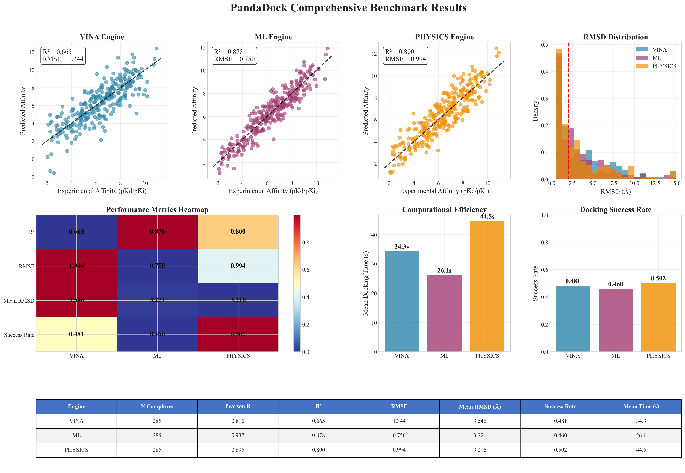
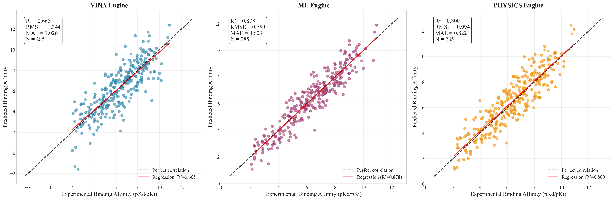
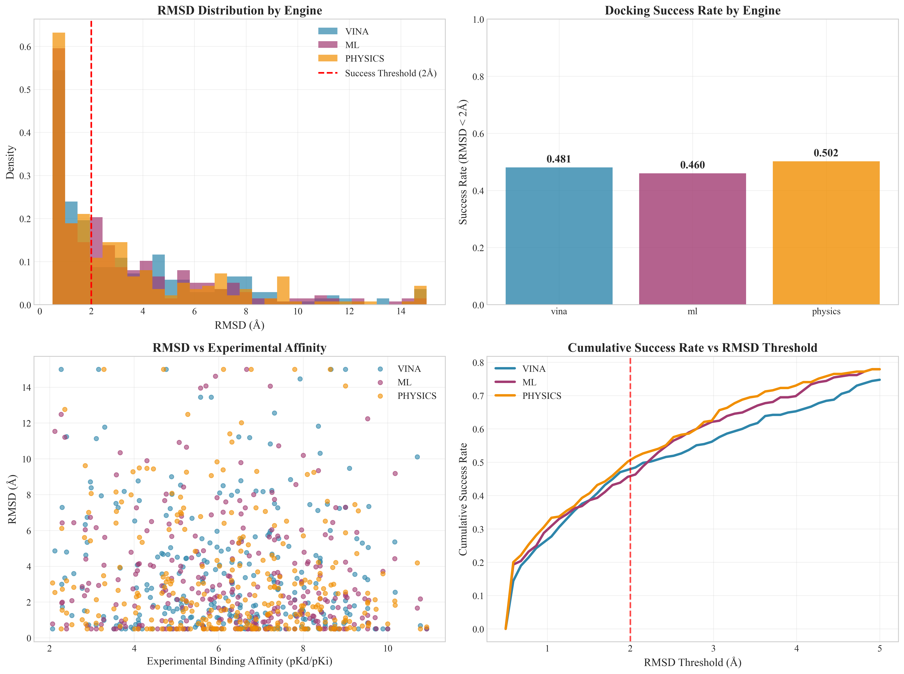
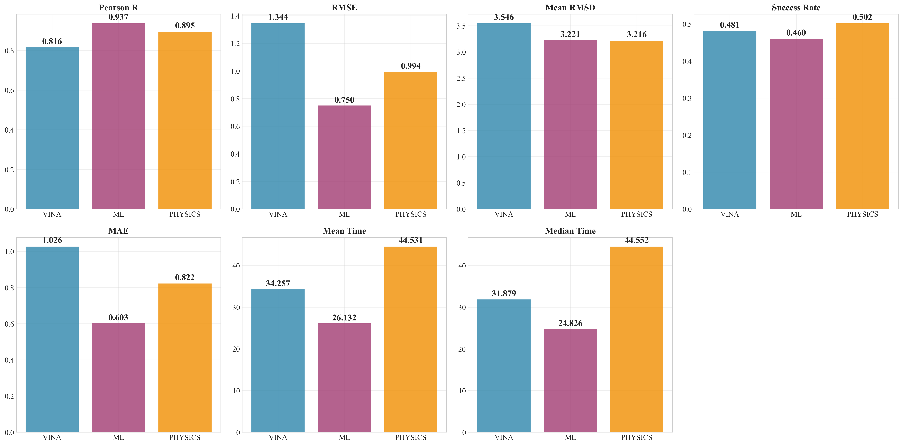
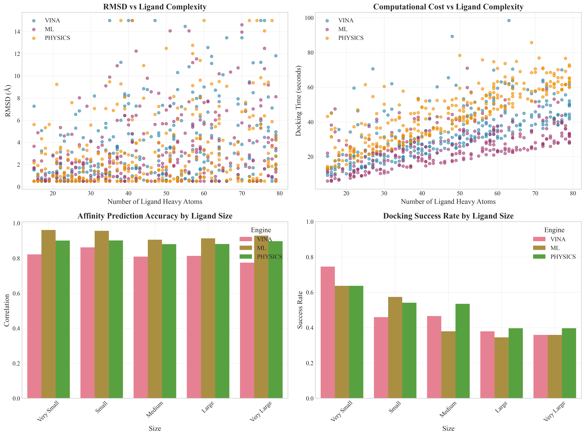
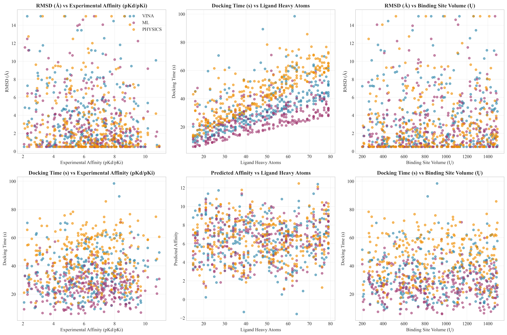

# PandaDock Comprehensive Benchmark Report

**Date:** 2025-07-10 14:19:30

**Total Complexes Evaluated:** 285
**Total Docking Runs:** 855
**Engines Evaluated:** vina, ml, physics

## Dataset Statistics

- **Experimental Affinity Range:** 2.07 - 10.92 pKd/pKi
- **Mean Experimental Affinity:** 6.35 ± 2.00
- **Ligand Size Range:** 15 - 79 heavy atoms
- **Mean Ligand Size:** 47.0 ± 18.6 heavy atoms

## Engine Performance Summary

### VINA Engine

- **Number of complexes:** 285
- **Affinity Prediction:**
  - Pearson correlation: 0.816
  - R²: 0.665
  - RMSE: 1.344
  - MAE: 1.026
- **Pose Prediction:**
  - Mean RMSD: 3.546 Å
  - Median RMSD: 2.224 Å
  - Success rate (RMSD < 2Å): 0.481
  - Success rate (RMSD < 3Å): 0.565
- **Computational Efficiency:**
  - Mean docking time: 34.3 seconds
  - Median docking time: 31.9 seconds
  - Time per heavy atom: 0.77 s/atom

### ML Engine

- **Number of complexes:** 285
- **Affinity Prediction:**
  - Pearson correlation: 0.937
  - R²: 0.878
  - RMSE: 0.750
  - MAE: 0.603
- **Pose Prediction:**
  - Mean RMSD: 3.221 Å
  - Median RMSD: 2.184 Å
  - Success rate (RMSD < 2Å): 0.460
  - Success rate (RMSD < 3Å): 0.621
- **Computational Efficiency:**
  - Mean docking time: 26.1 seconds
  - Median docking time: 24.8 seconds
  - Time per heavy atom: 0.60 s/atom

### PHYSICS Engine

- **Number of complexes:** 285
- **Affinity Prediction:**
  - Pearson correlation: 0.895
  - R²: 0.800
  - RMSE: 0.994
  - MAE: 0.822
- **Pose Prediction:**
  - Mean RMSD: 3.216 Å
  - Median RMSD: 1.960 Å
  - Success rate (RMSD < 2Å): 0.502
  - Success rate (RMSD < 3Å): 0.628
- **Computational Efficiency:**
  - Mean docking time: 44.5 seconds
  - Median docking time: 44.6 seconds
  - Time per heavy atom: 1.00 s/atom

## Statistical Comparisons

### RMSD Comparisons (Wilcoxon Rank-Sum Test)

| Engine 1 | Engine 2 | p-value | Significant |
|----------|----------|---------|-------------|
| VINA | ML | 0.3257 | No |
| VINA | PHYSICS | 0.1575 | No |
| ML | PHYSICS | 0.6335 | No |

### Performance by Ligand Size

#### Very Small Ligands

**Size range:** 15-27 heavy atoms
**Number of complexes:** 55

- **VINA:** RMSD = 1.766 Å, Success = 0.745
- **ML:** RMSD = 1.768 Å, Success = 0.636
- **PHYSICS:** RMSD = 1.958 Å, Success = 0.636

#### Small Ligands

**Size range:** 28-40 heavy atoms
**Number of complexes:** 61

- **VINA:** RMSD = 3.411 Å, Success = 0.459
- **ML:** RMSD = 2.414 Å, Success = 0.574
- **PHYSICS:** RMSD = 2.751 Å, Success = 0.541

#### Medium Ligands

**Size range:** 41-53 heavy atoms
**Number of complexes:** 58

- **VINA:** RMSD = 3.392 Å, Success = 0.466
- **ML:** RMSD = 3.881 Å, Success = 0.379
- **PHYSICS:** RMSD = 3.025 Å, Success = 0.534

#### Large Ligands

**Size range:** 54-66 heavy atoms
**Number of complexes:** 58

- **VINA:** RMSD = 4.589 Å, Success = 0.379
- **ML:** RMSD = 3.857 Å, Success = 0.345
- **PHYSICS:** RMSD = 4.175 Å, Success = 0.397

#### Very Large Ligands

**Size range:** 67-79 heavy atoms
**Number of complexes:** 53

- **VINA:** RMSD = 4.574 Å, Success = 0.358
- **ML:** RMSD = 4.240 Å, Success = 0.358
- **PHYSICS:** RMSD = 4.218 Å, Success = 0.396

## Generated Figures

- **Master Publication Figure:** 
- **Correlation Analysis:** 
- **RMSD Analysis:** 
- **Engine Performance:** 
- **Ligand Complexity Analysis:** 
- **Performance vs Properties:** 
